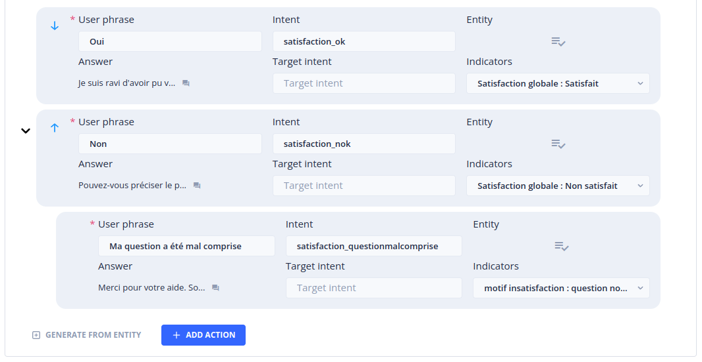
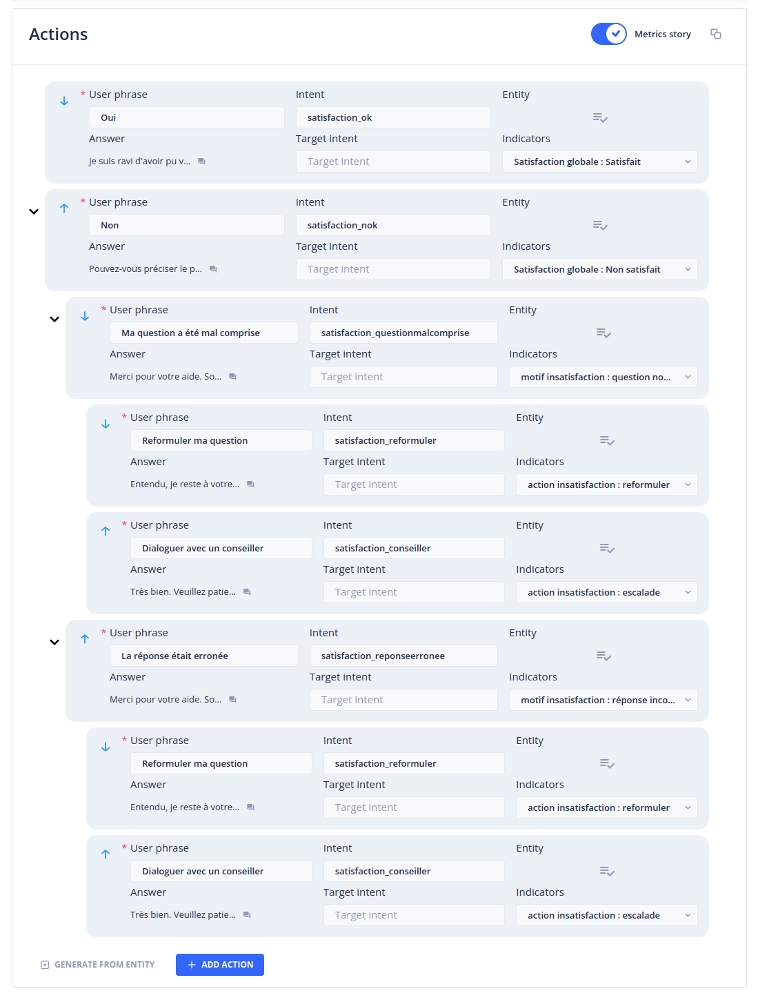
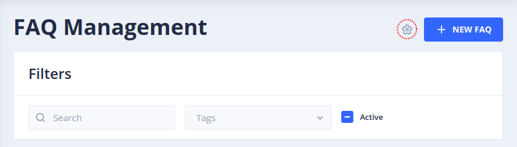
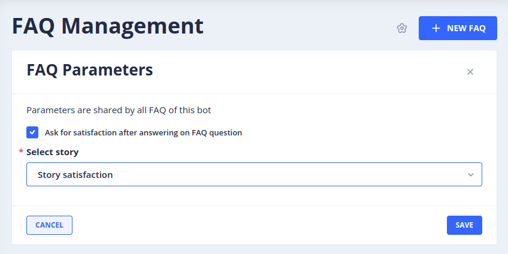

# The *Custom Metrics* menu

The _Custom Metrics_ menu allows you to create and view statistics on the consultation and use of Tock stories.

It is intended for a business audience that wants to monitor the performance of stories (FAQs, scenarios, etc.) within a Tock application.

> To access this page, you must have the _botUser_ role.

## *Metrics* tab

This page allows you to display a certain number of business-oriented statistics (unlike the _Analytics_ menu, whose statistics relate to technical criteria).

The statistics are displayed for a given period, which can be specified using the field at the top of the page. On its right, a set of shortcuts allow you to define this period in one click (last 3 days, last 7 days, last 30 days and last 3 months).

Then, for the selected period, come the following statistics:

- Number of user messages
- Number of answers provided by the bot
- Number of questions not understood by the bot
- Bot response rate

> To obtain reliable and correctly broken down statistics, it is necessary to create an unknown story (see section [Create an Unknown story](#create-unknown-story)).

### Section *Number of user messages*

This graph displays the number of user messages per day for the requested period

### Section *Distribution of stories*

This graph displays the distribution of _stories_ triggered following user questions. Hovering over the graph entries allows you to obtain the number of times the _story_ was triggered as well as the share taken by this _story_ in the total number of _stories_ triggered for the requested period.

If the number of _stories_ to display exceeds a certain threshold, an _Other stories_ category will be displayed, bringing together the _stories_ that recorded the lowest trigger rates.

Clicking on any of the graph entries opens a window displaying these same statistics in a detailed list (and possibly displaying the details of the _Other stories_)

To the right of the section title, a drop-down menu allows you to filter the _stories_ displayed by type and/or category. It also allows you to display _stories_ _metrics_ that are not listed by default.

### Section *Indicators*

> Indicators, associated with _metrics stories_, allow you to record user feedback, generally as part of a satisfaction _story_ or a survey. For more information on creating indicators and assigning them to _metrics stories_, refer to the [_Indicators_](#indicators-tab) and [_Metrics Stories_](#metrics-stories) sections

A drop-down list to the right of the section title allows you to select the indicator dimension to display. A dimension is a collection of indicators (see [_Indicators_ tab](#indicators-tab)).

For each indicator in the chosen dimension, a graph displays the distribution of user responses. The gray _No answer given_ section corresponds to the number of times a user did not answer the question asked. Hovering over the portions of the graph displays the number of responses provided for each indicator option as well as the percentage represented of all times the corresponding question was asked.

For each graph, a _Detail by story_ button is provided. _Detail by story_ displays a window gathering the graphs of the responses given to this indicator by _story_.

## *Indicators* tab {#indicators-tab}

_Indicators_ are used to measure user satisfaction or to conduct surveys.

An indicator generally corresponds to a question that will be asked to users after the execution of a _story_. It gathers one or more values ​​corresponding to the possible responses to this question.

Once defined, the indicators can be associated with _Actions_ of _Metric story_. The _Metric story_ can in turn be defined as a satisfaction _story_ of your FAQs or other types of _stories_. For more information on the definition of _Metric story_, refer to the section [_Metrics Stories_](#metrics-stories).

This page lists all the existing indicators.

An indicator is composed of the following elements:

- Its label
- The dimension to which it belongs
- Its possible values

An indicator must necessarily belong to at least one dimension but the same indicator can belong to several different dimensions. Dimensions are simple groupings of indicators facilitating their manipulation and consultation.

The following actions are available for each indicator:

- _Edit_: allows you to modify the attributes of the indicator (label, description, dimensions, values)
- _Delete_: allows you to delete the indicator. Note that deleting an indicator will prohibit viewing the statistics recorded for this indicator.

### Creating an indicator

You can create a new indicator by clicking on the _+ New Indicator_ button at the top right of the page. This opens a panel in which you can define:

- The indicator label
- A description (optional)
- One or more dimensions to which the indicator will be attached
- One or more values ​​that the indicator is likely to carry

For example, we can imagine a "Satisfaction" indicator that carries the values ​​"Satisfied" and "Not satisfied".

Note that the name of the indicator and its values ​​will not be directly displayed to users. The question and answer sentences will be defined at the level of the _actions_ of the _Metric story_ that you will be required to create in the next step. You can therefore choose a label and simple values ​​that will facilitate their manipulation.

As an example, we can imagine a dimension that brings together the following indicators and values:

- DIMENSION: Satisfaction
- INDICATOR: Overall satisfaction
- VALUE: Satisfied
- VALUE: Not satisfied
- INDICATOR: Reason for dissatisfaction
- VALUE: Question not understood
- VALUE: Incorrect answer
- INDICATOR: Dissatisfaction action
- VALUE: Redirect to a human
- VALUE: Reformulate my question

Based on this set of indicators, we can configure a _Metric story_ asking a set of questions to users and recording their answers with the aim of improving our Bot (see [_Metrics Stories_](#metrics-stories)).

### Filters

It is possible to search for indicators by entering text in the _Search_ field.

It is also possible to filter the list of indicators by selecting one or more dimensions in the drop-down list.

# Create a _Story Unknown_ {#create-unknown-story}

In order to explicitly distinguish user questions not understood by the bot, it is necessary to create a _story unknown_. This _story_ will be returned by the bot in cases where it has not identified an _intent_ corresponding to the user questions.
The _story unknown_ also allows you to provide a message to display to the user in the event that their question has not been understood.

To create a _story unknown_, go to _Stories & Answers_ in the main menu and access the _New story_ tab.
In the field provided, give a name to your _story unknown_ (for example `story unknown`) and click on the _add_ button.
On the page that appears, click on the _Edit story_ button.

A window opens. In the _Intent_ field, enter the string `unknown` and click _Save_.

In the _Answers_ section, enter the answer to return to users when their question has not been understood, then click _Create story_.

# _Metrics Stories_ {#metrics-stories}

Once defined, the indicators must be associated with the _actions_ of a _story_ in order to be triggered by users and thus result in the recording of a _hit_.

## Creating a satisfaction *Metrics Story*

From the main menu, go to _Stories & Answers_ then to the _New story_ tab.

In the field provided, enter the name of your satisfaction _story_ (for example `Story satisfaction`) then validate.
In the _Answer_ field, enter a user prompt (e.g. `Are you satisfied with the answer provided?`)

In the _Actions_ section, add a first action using the _+ Add action_ button:

Define the _User phrase_ of the action (e.g. `Yes`).

Indicate an _Intent_ name for the action (e.g. `satisfaction_ok`). A window appears to validate the creation of the _intent_. Validate by clicking on the _Create_ button.
Enter a response using the _Answer_ field of the action (e.g. `I am delighted to have been able to help you`).

In the _Indicators_ list, select the value of the indicator provided for this purpose (in our example, `Overall satisfaction: Satisfied`).

Repeat for the "Not satisfied" action:

In the _Actions_ section, add a second action using the _+ Add action_ button.
Define the _User phrase_ of the action (e.g. `No`).
Indicate an _Intent_ name for the action (e.g. `satisfaction_nok`).
Enter a response using the _Answer_ field (e.g. `Can you specify the problem encountered?`).
In the _Indicators_ list, select the value of the indicator provided for this purpose (in our example, `Overall satisfaction: Not satisfied`).

You will now be able to define the _Actions_ to propose to users who answered `No` to the initial question:

Using the mouse, hover over the second _action_ created with the _user phrase_ `No`. A contextual menu appears at the bottom of the action. Click on _Add action_. Expand the action using the chevron that appears to the left of it.

Define the _User phrase_ of the action (for example `My question was misunderstood`).
Indicate an _Intent_ name for the action (for example `satisfaction_questionmisunderstood`).
Enter an answer using the _Answer_ field (for example `Thank you for your help. Would you like to try to rephrase your question or be put in touch with an advisor?`).
In the _Indicators_ list, select the value of the indicator provided for this purpose (in our example, `Overall satisfaction: question not understood`).

Continue the operations described above until you have completely defined your satisfaction _story_ according to the desired indicators.

Now that you have assigned at least one indicator to an action, you have the possibility to mark this _story_ as a _Metric story_ using the switch located at the top right of the _Actions_ section.

You can now validate the creation of the _Metric story_ by clicking on the _Create story_ button at the bottom of the page.

> A _story_ marked as _Metric story_ allows you to record the satisfaction for the _story_ previously triggered by the user. A _Metric story_ must therefore be defined as a _story_ for redirecting business _stories. The indicators recorded following user responses will therefore refer to the story that was executed just before the _Metric story_ was triggered. If indicators are associated with the _actions_ of a _story_ not marked as _Metric story_, the statistics recorded will only concern the story carrying these _actions_.

## Defining a *Metric Story* as a redirection story

To define a _Metric Story_ as a _story_ for redirecting all your FAQs, go to the _Faq Management_ entry using the main menu.

Click on the `Faq parameters` icon at the top right of the page.

Enable the _Ask for satisfaction after answering on FAQ question_ checkbox then select the _Metric story_ previously created.

Click on the _Save_ button.

From now on, after each execution of a _story_ of type Faq, the _story_ "Story satisfaction" will be triggered and will allow to ask users for feedback.

For a more precise adjustment of the _stories_ giving rise to a redirection, go to _Stories & Answers_, _Rules_ tab