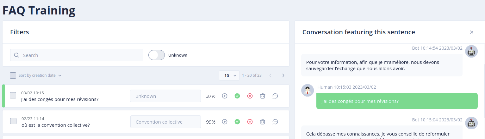

# The *FAQ Training* menu

The _FAQ Training_ menu allows you to enrich conversational models by associating user sentences with FAQ questions.
It is intended for a business audience unfamiliar with conversational concepts (intentions, entities, etc.).

> To access this page, you must have the _nlpUser_ role. ( more details on roles in [security](../../admin/security.md#roles) ).

This page lists all the sentences received by the _NLU_ model with the detected faq/scores.

These sentences can come from real users regardless of the channels, from an entry in the _Try it_ tab
or from a conversation via the _Test the bot_ page in _Tock Studio_.

## Sentence qualification

The following actions are available to qualify sentences:

* _Create New FAQ_: create a new FAQ question by automatically adding the selected sentence to the list of associated questions
* _Validate_: confirm the FAQ detected by the model and save the sentence in the latter (ultimately causing a reconstruction of the model)
* _Unknown_: qualify the sentence with an unknown intention (default response)
* _Delete_: delete the sentence (irreversible action)
* _Details_: display the details of the dialog in which the sentence was detected

## Filters
It is possible to search for sentences to qualify by entering text in the field _Search_.

It is possible to display the sentences associated with the _unknown_ intention by activating the _Unknown_ button.

## Continue...

Go to [Menu _FAQ Management_](../../user/studio/faq-management.md) for the rest of the user manual.

> You can also go directly to the next chapter: [Development](../../../dev/modes.md).