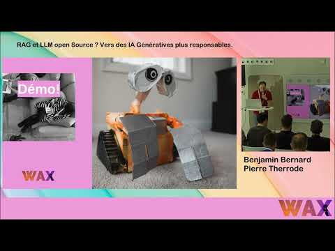
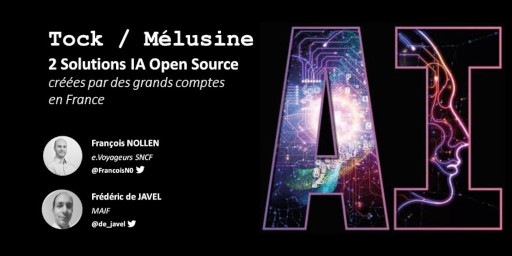
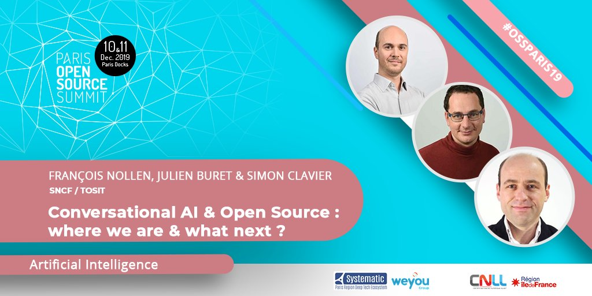
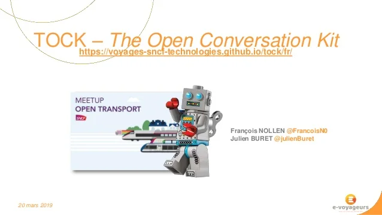
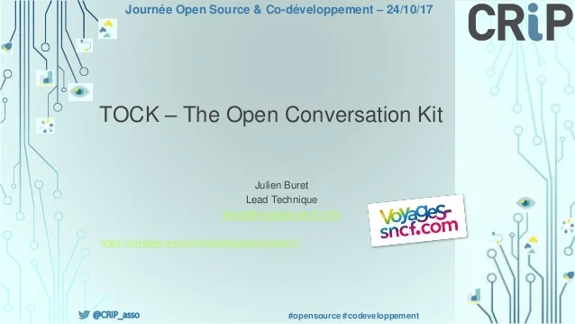

# Ressources Tock

Les différents supports et présentations ci-dessous donnent un aperçu de la solution Tock, 
en complément des [guides](../guides/studio.md)
 pour tester soi-même la plateforme.

## Conférences / Video

  * _REX - Hybride Gen AI with TOCK_ @ _[Open Source Experience 2024](https://www.opensource-experience.com/)_ (REX l’Open Source pour industrialiser l’IA Générative [TOSIT])
  [ℹ️ info](https://www.opensource-experience.com/event/#conf-15915)
  [📽️ 21 min](https://youtu.be/9ilX731vN64?si=g2RD2bij8i9O4uO1)

[![REX l’Open Source pour industrialiser l’IA Générative [TOSIT]](../../img/confREX.jpg)](https://youtu.be/9ilX731vN64?si=g2RD2bij8i9O4uO1)

* _Gen AI with TOCK_ @ _[WAX](https://www.waxconf.fr/)_
  **2024** (RAG et LLM Open Source ? Vers des IA Génératives plus responsables.)
  [ℹ️ info](https://www.waxconf.fr/#:~:text=RAG%20et%20LLM%20Open%20Source%20%3F%20Vers%20des%20IA%20G%C3%A9n%C3%A9ratives%20plus%20responsables.)
  [📽️ 45 min](https://youtu.be/lYmUeYoVkwc)

* _[20 minutes from zero to live chatbot with Tock](https://www.youtube.com/watch?v=UsKkpYL7Hto)_  
  @ _Open Source Experience_ **2021** (démonstration, en Anglais)
  [ℹ️ info](https://www.opensource-experience.com/event/20-minutes-from-zero-to-live-chatbot-with-tock/) /
  [📽️ 20 min](https://www.youtube.com/watch?v=UsKkpYL7Hto)

<a href="https://www.youtube.com/watch?v=UsKkpYL7Hto"
target="tock_osxp">

* _AlloCovid_ @ _Voice Tech Paris_
  **2020** (REX INSERM, Allo-Media & SNCF)
  [ℹ️ info](https://www.voicetechparis.com/conferences-2/)

* _[Tock & Mélusine](https://fr.slideshare.net/FrancoisN0/tock-mlusine-rex-ia-open-source-aiparis-2020)_ @ _AI Paris_ 
**2020** (REX SNCF & MAIF)
[ℹ️ info](https://aiparis.fr/2020/les-conferences/) /
[🔳 slides](https://fr.slideshare.net/FrancoisN0/tock-mlusine-rex-ia-open-source-aiparis-2020)

* _[Conversationnel & Open Source](https://www.youtube.com/watch?v=fTy6uit7Ejg)_ @ _Paris Open Source Summit_ **2019**  
(REX SNCF & invités EDF, Enedis, Orange, SogetiLabs, TOSIT)
[📽️ 30 min](https://www.youtube.com/watch?v=fTy6uit7Ejg) / 
[🔳 slides](https://fr.slideshare.net/FrancoisN0/conversational-ai-open-source-ossparis19)

* _[Développer un bot sur Messenger et Google Assistant en 30 minutes](https://www.youtube.com/watch?v=K4q8ZHw9TuI)_  
@ _Devoxx France_ **2018** (live coding _"tools in action"_)
[📽️ 30 min](https://www.youtube.com/watch?v=K4q8ZHw9TuI)

## Meetup / Supports

* [Présentation de Tock (avec SNCF & Enedis)](https://www.ima-dt.org/ima/event/detail.html/idConf/952)
  @ _Innovation Makers Alliance_ **(2021)**
  [ℹ️ info](https://www.ima-dt.org/ima/event/detail.html/idConf/952)

* [Tock - _The Open Conversation Kit_](https://fr.slideshare.net/FrancoisN0/tock-the-open-conversation-kit-meetup-open-transport-161569957)
 @ _Meetup Open Transport_ **(2019)**
 [🔳 slides](https://fr.slideshare.net/FrancoisN0/tock-the-open-conversation-kit-meetup-open-transport-161569957)

* [Tock - _The Open Conversation Kit_](https://fr.slideshare.net/FrancoisN0/tock-the-open-conversation-kit-crip-open-source)
 @ _CRiP OpenSource & Co-développement_ **(2017)**
 [🔳 slides](https://fr.slideshare.net/FrancoisN0/tock-the-open-conversation-kit-crip-open-source)

> N'hésitez pas à [partager](contact.md) d'autres supports et liens autour de Tock.

## Kit presse

Comme le reste des sources Tock, les logos sont disponibles sous [licence Apache 2](https://github.com/theopenconversationkit/tock/blob/master/LICENSE).

**Tock logo - default colors / transparent** (<a href="../../img/logo.svg" download="logo-default.svg">download</a>) :

**Tock logo - blue / transparent** (<a href="../../img/Logo_Tock_Blue.svg" download="logo-blue.svg">download</a>) :

**Tock logo - black / transparent** (<a href="../../img/logo-black.svg" download="logo-black.svg">download</a>) :

**Tock logo - white / transparent** (<a href="../../img/Logo_Tock_White.svg" download="logo-white.svg">download</a>) :

