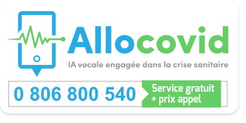
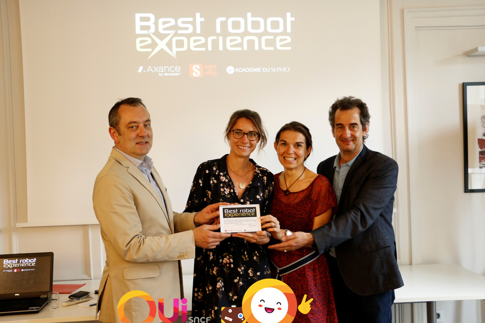
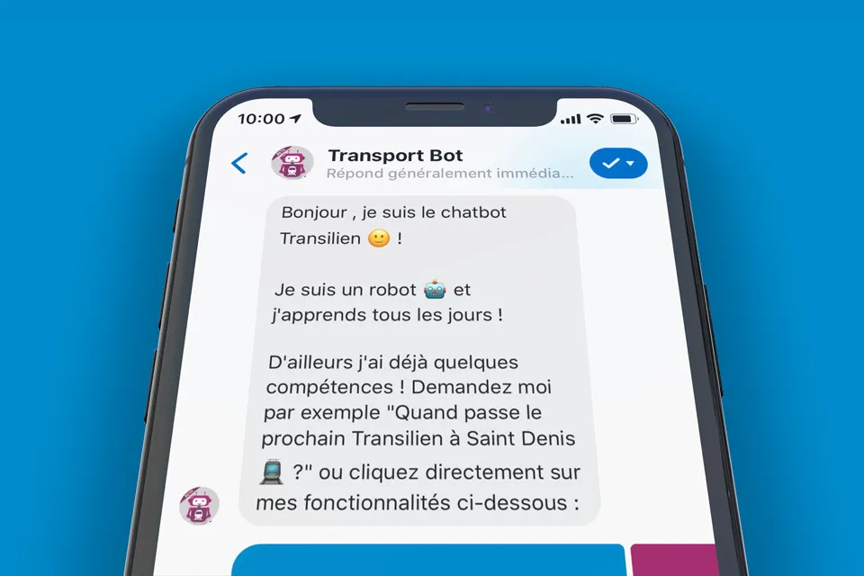
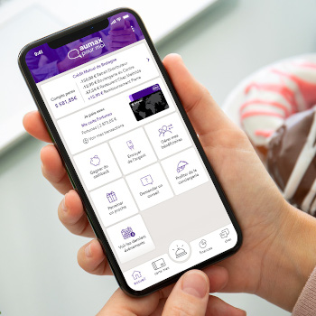
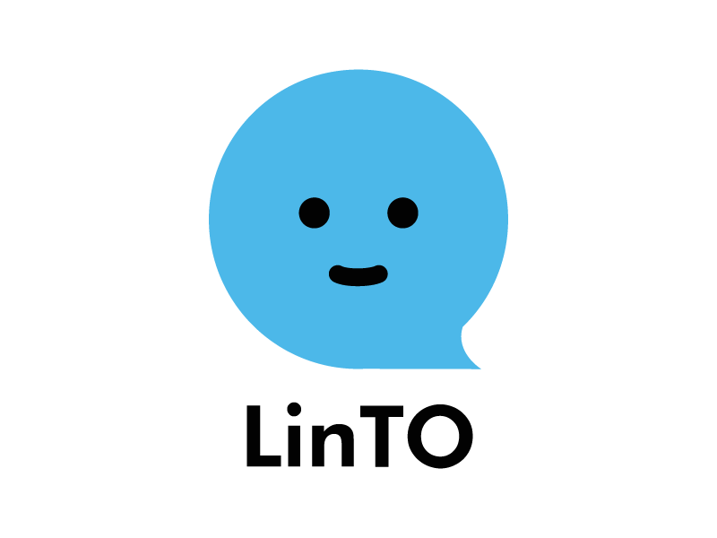
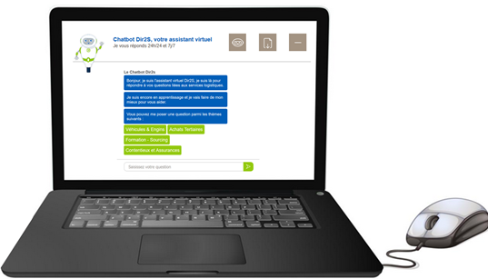
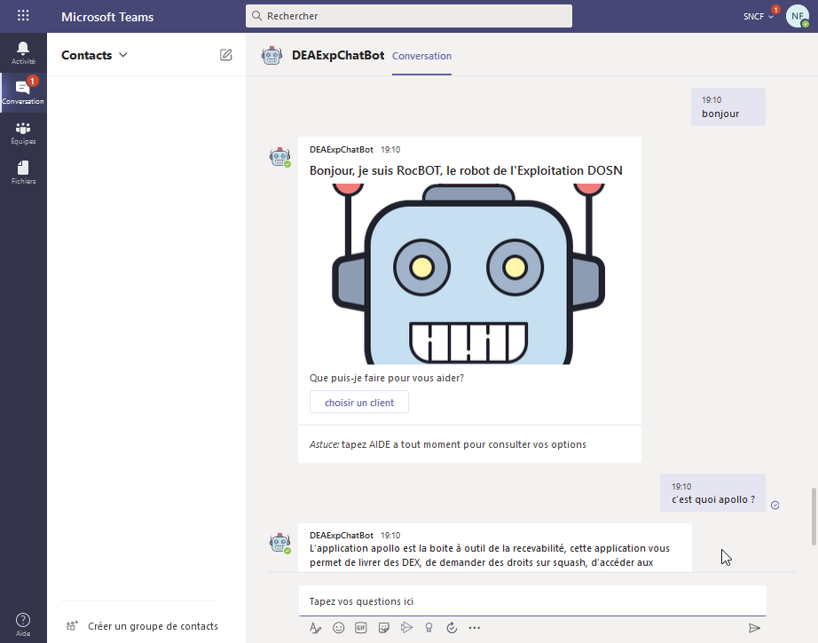
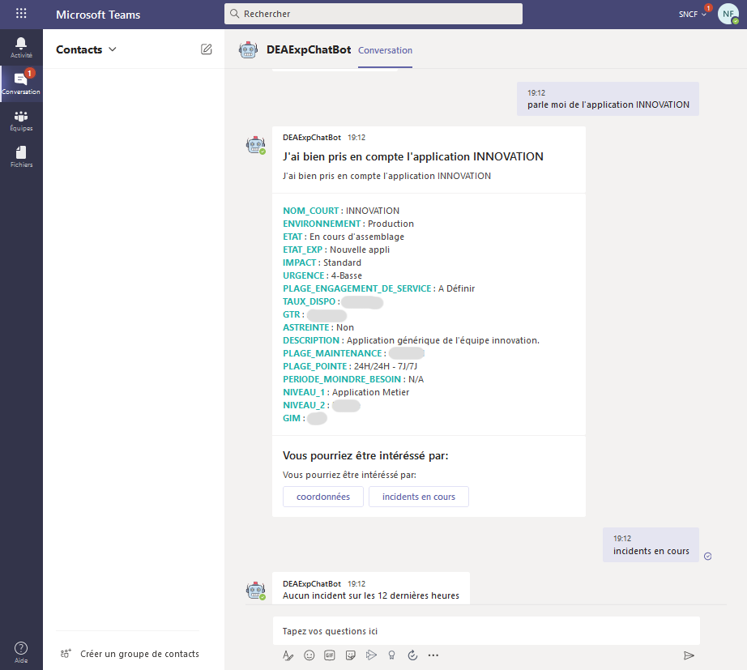
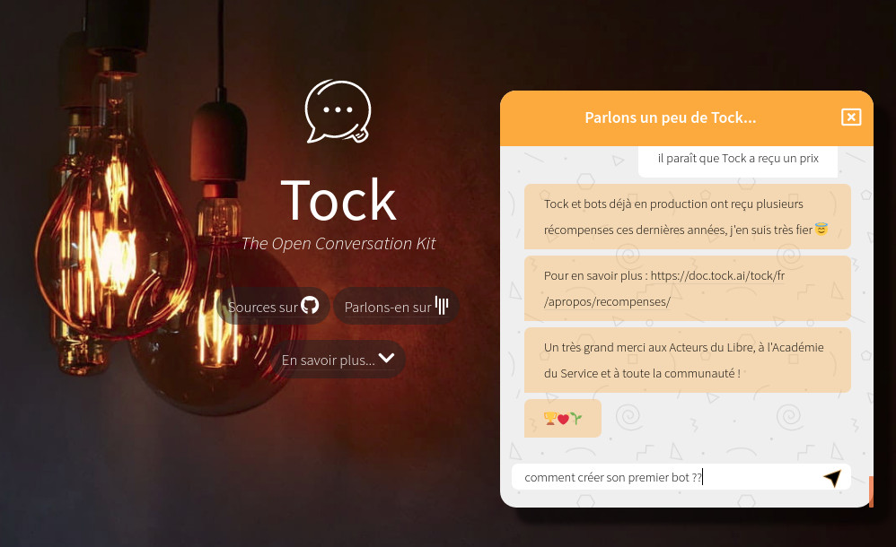

# Vitrine utilisateurs

Depuis sa création pour [OUI.sncf](https://www.oui.sncf/) en 2016 en passant par le
service _[AlloCovid](https://www.allocovid.com/)_ en 2020, Tock est utilisé par de plus en plus
d'équipes et d'organisations pour créer des bots conversationnels dédiés à des usages divers :

* domaines : santé, transport, énergie, e-commerce...
* _business to customer_ et _business to business_ 
* FAQ et arbres de décision _"0 code"_
* assistance, _selfcare_ ou bascule à un conseiller
* transactionnel (devis/réservations/paiements, _help desks_, supervision, etc.)
* canaux : texte & voix (Web & mobile, messageries, enceintes connectées, téléphonie)

Cette page présente différents assistants et produits connus construits avec Tock, 
dont certains ont été [récompensés](awards.md) par la communauté.

## Santé

### *AlloCovid*

Le service _[AlloCovid](https://www.allocovid.com/)_ permet d'informer et d'orienter la population sur 
le Covid-19, reprenant le questionnaire prédéfini par le Ministère de la Santé.

> _IA vocale engagée dans la crise sanitaire_

Ce service conversationnel est le fruit de la collaboration de nombreux experts français, 
partenaires technologiques et bénévoles. Pour en savoir sur la génèse du projet, l'équipe et les partenaires, le 
fonctionnement du bot, la presse, etc. 
rendez-vous sur [www.allocovid.com](https://www.allocovid.com/).

Disponible par téléphone, sur le Web et WhatsApp, _AlloCovid_ est construit autour d'un bot Tock et intègre des solutions complémentaires 
comme les technologies vocales [Allo-Media](https://www.allo-media.net/) et [Voxygen](https://www.voxygen.fr/). 

Le bot _AlloCovid_ est construit autour de technologies open source (à travers la plateforme Tock), 
et lui-même open source : les sources du bot sont disponibles sur le dépôt [`allocovid`](https://github.com/theopenconversationkit/allocovid).

> Avec les sources du bot on trouve également celles du [_connecteur Allo-Media_](../user/guides/canaux.md#allo-media), 
> quelques explications techniques sur le bot et la [spécification fonctionnelle](https://github.com/Delegation-numerique-en-sante/covid19-algorithme-orientation) 
du questionnaire Covid.

 
* **Nom :** _[AlloCovid](https://www.allocovid.com/)_
* **Date de naissance :** en production au printemps 2020
* **Domaine :** informations sanitaires et orientation vers les services de santé
* **Canaux :** texte & voix, par téléphone, sur WhatsApp et site Web

## Transport & e-commerce

### *OUIbot*, le bot OUI.sncf

_[OUIbot](https://www.oui.sncf/services/assistant)_ est l'assistant conversationnel de OUI.sncf. Disponible depuis 2016 
sur le réseau social Facebook Messenger, _OUIbot_ s'est construit avec les premières versions de Tock.

> _Avec OUIbot, réserver un billet de train n'a jamais été aussi simple ! Il vous assiste dans la préparation de vos 
voyages, permet d'effectuer rapidement et simplement une réservation complète, de la recherche à l'achat (paiement inclus), 
et vous accompagne durant votre voyage._

Grâce aux nombreux connecteurs Tock, _OUIbot_ répond présent sur de nombreux canaux conversationnels :
 site [www.oui.sncf](https://www.oui.sncf/bot), réseaux sociaux, assistants vocaux, enceintes connectées et même 
 [IAffiches avec JCDecaux](https://ouitalk.oui.sncf/blog/innovation/oui-sncf-signe-une-campagne-d-affichage-pilotee-par-une-intelligence-artificielle).

En 2019, _OUIbot_ accompagne près de 10 000 utilisateurs par jour. Il a été élu _[Best Robot Experience](https://blog-cultures-services.com/2019/07/09/ouibot-de-ouisncf-laureat-prix-best-robot-experience-2019/)_
 pour la deuxième année consécutive.

 
* **Nom :** _[OUIbot](https://www.oui.sncf/services/assistant)_
* **Date de naissance :** en production depuis 2016
* **Domaine :** distribution, transactionnel (réservations, paiements), alertes & push notifications, relai vers un agent
* **Canaux :** texte & voix, sur le site Web entreprise, Messenger, WhatsApp, Business Chat (Messages), Google Assistant, 
Google Home, Alexa, IAffiches JCDecaux

### *L'Assistant SNCF*

_[L'Assistant SNCF](https://www.sncf.com/fr/itineraire-reservation/informations-trafic/application-sncf)_ est
l'application mobile des voyageurs SNCF sur Android et iOS, couvrant le train mais aussi d'autres modes de transport.

> Avec l’_Assistant SNCF_, vous pouvez calculer votre itinéraire, rester informé en temps réel, acheter directement vos
>tickets de transport ou encore réserver votre course en VTC. En attendant de nouvelles fonctionnalités à venir.

Accessible via le "microphone" dans l'application mobile, le bot conversationnel de l'_Assistant SNCF_ est construit
avec Tock et les fonctions _speech-to-text_ Android et iOS.

* **Nom :** _[L'Assistant SNCF](https://www.sncf.com/fr/itineraire-reservation/informations-trafic/application-sncf)_
* **Date de naissance :** en production, fonction vocale Tock depuis 2019
* **Domaine :** voyage & transport (recherche itinéraires en multi-modal, etc.)
* **Canaux :** vocal, sur l'application mobile SNCF pour Android et iOS

### *Tilien*, le chatbot Transilien

_[Tilien](https://www.facebook.com/botsncftransilien/)_ est le chatbot Transilien sur Messenger.

> Conçu comme un compagnon de voyage personnel et amical, il informe des prochains départs, l'état du trafic, les travaux
>en cours et à venir, propose des itinéraires et bien d'autres choses (plans des lignes, fiches horaires, etc.) sur
>l'ensemble du réseau ferré Ile-De-France : Métro, RER, Transilien, Tram.

Motorisé par Tock, le chatbot vous attend sur Facebook Messenger pour offrir ses services.

* **Nom :** _[Tilien](https://www.facebook.com/botsncftransilien/)_
* **Date de naissance :** en production, depuis 2018 sur Tock
* **Domaine :** transport & assistance (recherche itinéraires, plans des lignes, état du trafic, etc.)
* **Canaux :** texte, sur Messenger ([_botsncftransilien_](https://www.facebook.com/botsncftransilien/))

### *Mon Assistant TGV INOUI*

_[Mon Assistant](https://www.facebook.com/TGVINOUI/)_ informe les clients et voyageurs de la marque TGV INOUI avant,
pendant et après leur trajet.

> Le chatbot est capable de donner l'état du trafic, le quai de départ d'un train, la ou les places du client, les
>services à bord (le bar, les prises électriques, etc.). Il permet aussi de parler avec un agent SNCF tout
>en restant dans la même conversation.

Présent sur la page Facebook _TGV INOUI_ et le
[portail Wifi à Bord](https://www.sncf.com/fr/offres-voyageurs/tgv-inoui/connectez-vous-pendant-votre-voyage), l'assistant
s'appuie sur Tock et le [`tock-react-kit`](../user/guides/canaux.md#react).

* **Nom :** _[Mon Assistant TGV INOUI](https://www.facebook.com/TGVINOUI/)_
* **Date de naissance :** en production depuis 2019
* **Domaine :** assistance & info voyageur (info quai, infos voyage en cours, services à bord), relai vers un agent
* **Canaux :** texte, sur le [portail Wifi à Bord](https://www.sncf.com/fr/offres-voyageurs/tgv-inoui/connectez-vous-pendant-votre-voyage)
  et Messenger ([_TGV INOUI_](https://www.facebook.com/TGVINOUI/))

### *L'Agent virtuel SNCF*

L'_[Agent virtuel SNCF](https://www.facebook.com/SNCFOFFICIEL/)_ présente de manière conversationnelle l'information
voyageur et les éventuelles perturbations sur tous les trains (TGV, IC, TER, Eurostar...).

> On peut interroger le bot par numéro de train, dossier voyageur, prochains départs, etc. pour obtenir les dernières
>informations et l'état du trafic, ou encore parler à un Agent.

Accessible sur le site Web [_sncf.com_](https://www.sncf.com/fr/itineraire-reservation/info-trafic/), la page Facebook
et la page Twitter de la SNCF, l'_Agent virtuel_ est basé sur Tock et utilise le [`tock-react-kit`](../user/guides/canaux.md#react)
pour l'intégration Web.

* **Nom :** _[Agent virtuel SNCF](https://www.facebook.com/SNCFOFFICIEL/)_
* **Date de naissance :** en production depuis 2019
* **Domaine :** voyage & transport (état du trafic, travaux, prochains départs), relai vers un agent
* **Canaux :** texte, sur [_sncf.com_](https://www.sncf.com/fr/itineraire-reservation/info-trafic/)
  ([lien direct](https://bot.assistant.sncf/)), Messenger ([_SNCFOFFICIEL_](https://www.facebook.com/SNCFOFFICIEL)) et
  Twitter ([_@sncf_](https://twitter.com/SNCF))

## Energie

### *Callbot EDF*

Sous la forme d'un _POC (Proof Of Concept)_ pour éprouver un cas d'usage, un callbot a été conçu par la _Direction des
Systèmes d'Informations et du Numérique (DSIN)_ d'[EDF Commerce](https://www.edf.fr/).

> Il a la particularité d'être conçu pour pouvoir fonctionner avec la solution de téléphonie
> ([Genesys](https://www.genesys.com)) afin de pouvoir router les appels clients vers la bonne compétence humarine ou
> automatisée.  
> Il permet par ailleurs de transférer le contexte de la conversation qu'il y a eu entre le client et le callbot
> auprès du conseiller clientèle.

Le callbot est construit avec Tock et utilise le [_connecteur Allo-Media_](../user/guides/canaux.md#allo-media).
La solution de _Speech-To-Text (STT)_ utilisée est [Allo-Media](https://www.allo-media.net/), et la solution
de _Text-To-Speech (TTS)_ est [Voxygen](https://www.voxygen.fr/).

* **Nom :** _Callbot EDF_
* **Date de naissance :** janvier 2021
* **Domaine :** Relation Client / Conseiller
* **Canaux :** voix (téléphonie)

### *Chatbots Enedis*

Plusieurs chatbots [Enedis](https://www.enedis.fr/) sont conçus avec la solution Tock.

Le _Chatbot clients Enedis_ permet aux 35 millions de clients Enedis de poser des 
questions liées à l'énergie, sans nécessité de prendre contact avec un conseiller.

> Cet agent conversationnel permet un premier niveau de prise en charge des sollicitations clients, 
> adressant des questions simples et non personnalisées sur différentes thématiques (espace client, compteur Linky, 
> demandes de raccordement, dépannage, etc.).  
> Il propose également un transfert vers un Live Chat où le client pourra 
> échanger avec un conseiller en cas d’impossibilité du chatbot à répondre à la demande.

Co-construit avec des experts métiers Enedis sur la solution Tock, ce chatbot est disponible 
sur le site [Enedis.fr](https://www.enedis.fr/).

* **Nom :** _Chatbot clients Enedis_
* **Date de naissance :** en production depuis février 2021
* **Domaine :** tous les métiers de l'énergie
* **Canaux :** texte, sur le site [Enedis.fr](https://www.enedis.fr/)

> Voir aussi le [_Chatbot interne Enedis_](#chatbot-interne-enedis), également conçu avec Tock 
> pour un usage interne à l'entreprise depuis 2020.

## Banque

### *MaxBot*, bot bancaire chez Aumax pour moi

[Aumax pour moi](https://www.aumaxpourmoi.fr/) est une application qui vous permet de regrouper tous vos comptes et toutes vos cartes dans un seul et même endroit. Vous facilitez votre quotidien en n'utilisant qu'une seule application et une unique carte. Pour vous accompagner au quotidien, Aumax pour moi vous permet :

* de gagner du cashback ; 
* d'envoyer et recevoir de l'argent ;
* de faire appel à un service de conciergerie ;
* de demander des conseils d'ordres financiers, pour des projets de vie etc. 
* et bien plus encore !

Au sein de cette application, le bot Aumax pour moi, basé sur Tock, vous assiste sur toutes les questions d'ordre pratique, sur le fonctionnement de l'application, de vos comptes et de la carte max.

Le bot est disponible sur le chat de l'application [Aumax pour moi](https://www.aumaxpourmoi.fr/).
Aumax pour moi prend en charge et répond à près de 5 000 sollicitations quotidiennes. 

* **Nom :** _Aumax pour moi_
* **Date de naissance :** en production depuis 2019
* **Domaine :** bancaire, service, assistant personnel 
* **Canaux :** texte, sur l'application mobile

## Assistants personnels

### *LinTO by Linagora*

La plateforme _[LinTO](https://linto.ai/fr/enterprises)_ est une boîte à outils Open Source permettant le développement
et l'intégration de processus d’interactions vocales répondant aux besoins des professionnels et de l’industrie.

> _LinTO_ est un assistant intelligent Open Source conçu par LINAGORA :
> basé exclusivement sur des technologies Open Source, _LinTO_ est prêt pour le cloud mais sans GAFAM
> (Google-Amazon-Facebook-Apple-Microsoft), et respecte votre vie privée sans partager vos données pour usage commercial.
>
> _LinTO_ utilise l'IA pour capter votre voix et vous aider tout au long de la journée, même en réunion, à réduire
> les tâches stressantes ou chronophages : gestion d'agenda, rappels, prise de notes, emails, météo, trafic, dictionnaire ,
> actualités, etc.
>
> Le projet de recherche est subventionné par le PIA (Programme d'Investissement d'Avenir) de l'état Français dans le
> cadre des Grands Défis du numérique. Il allie des entreprises technologiques telles que LINAGORA et ZELROS et des
> laboratoires de recherche comme l'IRIT, le LaaS, le CNRS et le laboratoire de recherche en informatique de l'école polytechnique.

Le service _LinTO NLU (Natural Language Understanding)_ est basé sur Tock et permet l’utilisation de plusieurs
modèles IA dédiés à des cas d’utilisation spécifiques. Il apprend automatiquement
selon les usages lors de l’ajout ou suppression de compétences (_Skills_) à la plateforme.

{style="width:200px;"}

* **Nom :** _[LinTO](https://linto.ai/fr/enterprises)_
* **Date de naissance :** en production avec Tock depuis 2019
* **Domaine :** assistant personnel pour les entreprises (agenda, emails, prise de notes, etc.)
* **Canaux :** vocal (portabilité Raspberry Pi, ARM, Android, Web...)

## Bots internes

### *Chatbot interne Enedis*

Le _Chatbot interne Enedis_ permet aux 39 000 salariés [Enedis](https://www.enedis.fr/) un accès simplifié aux
services logistiques de l’entreprise.

> Cet agent conversationnel intelligent offre un support de 1er niveau en répondant
aux questions les plus fréquentes des salariés et en orientant vers les outils Métiers de gestion de demande.
Il a également vocation à mieux appréhender les besoins des salariés via l’analyse des questions fréquentes.

Construit avec Tock, le chatbot est disponible sur un site Web interne à l'entreprise.

* **Nom :** _Chatbot interne Enedis_
* **Date de naissance :** en production depuis 2020
* **Domaine :** services logistiques internes
* **Canaux :** texte, sur un site Web interne

### *Eve*, un bot interne polyvalent (SNCF)

_Eve_ est l'assistant interne des collaborateurs [e.Voyageurs SNCF](https://www.sncf.com/fr/groupe/newsroom/e-voyageurs-sncf).

> Le chatbot répond aux questions courantes, renvoie vers les bons contacts et outils collaboratifs de l'entreprise, 
>automatise des demandes courantes au Support Informatique, Services Généraux, Direction Juridique, etc. 
>Les équipes Devops peuvent aussi lui demander l'état de la production, les prochaines interventions, ou d'effectuer 
>directement certaines opérations pour plus de simplicité et de réactivité.

_Eve_ est à l'écoute des collaborateurs dans l'entreprise et en mobilité sur Teams avec Tock.

* **Nom :** _Eve_
* **Date de naissance :** en production depuis 2019
* **Domaine :** assistance en interne & B2B (FAQ, Support Informatique, RH, Juridique), automatisations DevOps (supervision, 
déploiements, gestion de production, etc.)
* **Canaux :** texte & voix, en interne dans l'entreprise et en mobilité via Teams

### *RocBOT*, un assistant pour l'Exploitation (SNCF)

_RocBOT_ est destiné aux Exploitants des équipes DEA SNCF. Il est à l'écoute en interne et en mobilité via Teams.

> Le chabot aide les collaborateurs à trouver rapidement les informations utiles sur le parc applicatif. 
> Il peut aussi vérifier si des incidents sont remontés par la supervision, donner l'agenda des astreintes, 
> les bons contacts, etc.

_RocBOT_ est en production depuis 2020, disponible sur desktop et en mobilité grâce au 
[_connecteur Teams_](../user/guides/canaux.md#teams) fourni avec Tock.

* **Nom :** _RocBOT_
* **Date de naissance :** en production depuis 2020
* **Domaine :** exploitation et assistance en interne (FAQ, Support exploitabilité, relais ITSM, etc.)
* **Canaux :** texte & voix, en interne dans l'entreprise et en mobilité via Teams

## Autres

### *Toki*, le bot pour découvrir Tock

_Toki_ s'adresse à tous ceux qui découvrent et utilisent Tock. Il répond à des questions courantes et apprend 
régulièrement notamment de la [communauté Tock sur Gitter](https://gitter.im/tockchat/Lobby).

> _Comment créer votre premier bot ?  
> Comment installer Tock ?  
> Où trouver les sources, la licence ?..._  
> N'hésitez pas à poser la question à _Toki_. S'il ne sait pas (encore) répondre, réessayez quelques jours après ;).
> Pour les anglophones, _Toki_ arrive bientôt sur le site EN.

Le bot est construit entièrement "0 code" grâce à _Tock Studio_. Autant une démo qu'un outil pour la 
communauté, _Toki_ est hébergé sur la [plateforme démo publique](https://demo.tock.ai/), 
il utilise le [_connecteur Web_](../user/guides/canaux.md#web-generique) et le 
[_kit React_](../user/guides/canaux.md#react) fournis avec Tock pour s'intégrer en quelques lignes de HTML/JS/CSS 
sur le [site](https://doc.tock.ai/fr/).

* **Nom :** _Toki_
* **Date de naissance :** en production depuis 2021
* **Domaine :** assistance à la communauté et FAQ
* **Canaux :** texte, sur le [site Web](https://doc.tock.ai/fr/) de la solution

## Et vous ?

D'autres assistants conversationnels développés avec Tock sont utilisés par différentes organisations
(notamment les membres du [TOSIT](http://tosit.fr/)). 
Ces bots ne sont pas toujours destinés au grand public et leurs organisations ne communiquent pas 
nécessairement dessus. Nous mentionnons ces projets si l'occasion se présente ;)

N'hésitez pas à faire un tour sur le [tchat Gitter](https://gitter.im/tockchat/Lobby) 
de la communauté, vous pourrez constater que de plus en plus de professionnels et particuliers, étudiants,
PME et ESN, expérimentent ou utilisent Tock pour leurs projets d'assistants ou d'applications _NLP_.

La plateforme est suffisamment générique pour permettre de nombreux usages et l'intégration de canaux 
internes ou externes. Si vous avez un doute sur les possibilités de Tock ou la faisabilité d'un nouveau projet, vous pouvez 
[nous contacter](contact.md) pour en parler.

_Quant à vos propres réalisations, n'hésitez pas à les partager ! 🙂_
