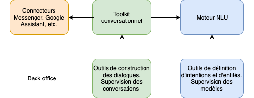
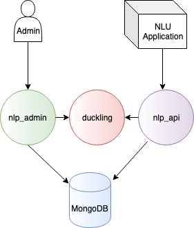

# Architecture de Tock

Ce chapitre présente l'architecture générale d'une plateforme Tock : composants et dépendances,
flux, configuration de proxies, etc.

## Architecture fonctionnelle

Deux composants majeurs sont disponibles :

* le moteur _NLU_ : _Natural Language Understanding_ (voir [_Tock Studio_](../../user/studio.md))
* le framework conversationnel intégré aux services _NLU_ et à différents connecteurs comme 
 Messenger, Google Assistant ou Slack (voir [manuel développeur](../../dev/modes.md) et [connecteurs](../user/guides/canaux.md)).

 
La plateforme NLU est indépendante de la partie conversationnelle. Il est possible d'utiliser le NLU sans devoir 
maîtriser la complexité induite par la gestion des conversations. Dans certain cas d'usage importants, comme l'[Internet des objets](https://fr.wikipedia.org/wiki/Internet_des_objets), 
l'utilisation d'un modèle NLU seule est pertinente.

## Architecture technique

Tock est composé de plusieurs composants applicatifs (_conteneurs_ lorsqu'on utilise Docker) 
et d'une base de donnée [MongoDB](https://www.mongodb.com).

> Les descripteurs [Docker](https://www.docker.com/) et [Docker Compose](https://docs.docker.com/compose/) fournis 
(ie. les `Dockerfile` et `docker-compose.yml`) décrivent l'architecture de Tock.
>
>Un exemple complet se trouve dans le fichier [`docker-compose-bot-open-data.yml`](https://github.com/theopenconversationkit/tock-docker/blob/master/docker-compose-bot-open-data.yml) 
>disponible dans le dépôt [`tock-docker`](https://github.com/theopenconversationkit/tock-docker). 

### Base de données MongoDB

La base Mongo doit être configurée en _replica set_, c'est à dire avec au minimum 3 instances déployées.
C'est obligatoire car Tock utilise la fonctionnalité des [Change Streams](https://docs.mongodb.com/manual/changeStreams/)
qui a comme pré-requis l'installation en replica set.

Il s'agit également d'une bonne pratique afin d'assurer une haute disponibilité de la base de données. 

### Composants applicatifs

Voici une description rapide des différents composants applicatifs (et images [Docker](https://www.docker.com/) fournies 
avec Tock) :

* Interfaces et outils _Tock Studio_ :
    * [`tock/bot_admin`](https://hub.docker.com/r/tock/bot_admin) : _Tock Studio_

* Partie _NLU_ :
    * [`tock/build_worker`](https://hub.docker.com/r/tock/build_worker) : reconstruit les modèles automatiquement dès que nécessaire
    * [`tock/duckling`](https://hub.docker.com/r/tock/duckling) : analyse les dates et types primitifs en utilisant [Duckling](https://duckling.wit.ai)
    * [`tock/nlp_api`](https://hub.docker.com/r/tock/nlp_api) : analyse les phrases à partir des modèles
construits dans _Tock Studio_

* Partie conversationnelle :
    * [`tock/bot_api`](https://hub.docker.com/r/tock/bot_api) : API pour développer des bots (mode [_Tock Bot API_](../dev/bot-api.md))
    * [`tock/kotlin_compiler`](https://hub.docker.com/r/tock/kotlin_compiler) (facultatif) : compilateur de scripts 
pour les saisir directement dans l'interface [_Stories and Answers_](../user/studio/stories-and-answers.md) de _Tock Studio_

Un dernier composant, le bot lui-même, doit être ajouté et rendu accessible aux partenaires et canaux externes auxquels 
 on souhaite s'intégrer.

> Bien entendu l'implémentation du bot n'est pas fournie avec Tock (chacun implémente ses fonctionnalités propres pour son besoin) 
>mais un exemple est disponible dans 
[`docker-compose-bot-open-data.yml`](https://github.com/theopenconversationkit/tock-docker/blob/master/docker-compose-bot-open-data.yml).

### Modes de déploiement

- Le mode _plateforme NLU_ seul (sans partie conversationnelle) :

- Le mode _Tock Bot API_ (recommandé pour la plupart des cas), permettant de développer en [Kotlin](https://kotlinlang.org/) 
ou un autre langage à travers l'API conversationnelle de Tock :

- Le mode _Tock Bot intégré_ (historique) permettant de développer en [Kotlin](https://kotlinlang.org/) uniquement 
en utilisant toutes les possibilités de Tock mais en accédant à la base MongoDB directement depuis le bot :

## Voir aussi...

* [Installation](installation.md)
* [Sécurité](security.md)
* [Supervision](supervision.md)
* [Cloud](cloud.md)
* [Haute disponibilité](availability.md)
