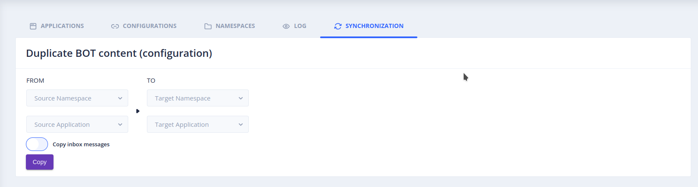

# Documentation de la Fonctionnalité de Synchronisation Multilingue

Cette documentation présente en détail notre fonctionnalité de synchronisation multilingue désormais accessible via les paramètres de votre application. Elle se présente comme suit :

Cette fonctionnalité demande à l'utilisateur de spécifier une source et une cible, chacune associée à un namespace et une application, pour synchroniser les données entre différents bots. Elle facilite le développement, les tests et la maintenance de vos chatbots, que ce soit en mode monolingue ou multilingue.

## Activation

Vous devez demander à votre administrateur de passer la propriété `tock_namespace_open_access`à `true` sur tock studio pour pouvoir accéder à cette fonctionnalité.

## Fonctionnalités Clés :

La fonction de synchronisation offre plusieurs fonctionnalités essentielles :

- **Copie de Stories et d'Intentions :** Vous pouvez synchroniser des "stories" et leurs intentions entre un bot Source et un bot Target, que ce soit en environnement de développement ou de production. Cela facilite les tests et les améliorations sans affecter directement la version en production.

  _**ATTENTION:** Il est important de noter que lors de la synchronisation, les "stories" du bot de target qui ne se trouvent pas dans le bot de source seront supprimées, et le reste sera écrasé par les "stories" du bot source._

- **Écrasement de l'Entraînement :** L’entraînement du bot Source écrase celui du bot Target.

  _**INFO:** Seules les informations préexistantes dans le bot Source sont affectées, préservant ainsi les informations spécifiques au bot Target qui ne sont pas dérivées du bot Source._

- **Copie des phrases non entraînées (Copy inbox messages) :** lorsque cette fonctionnalité est activée, les phrases non entrainées sont aussi rapatriées. Le cas d'utilisation typique de cette fonctionnalité est de permettre de copier un bot en production possédant des phrases non entrainées vers un bot de pre-prod afin d'entraîner ces phrases sur des intentions nouvellement créées.

## Intérêts de la Fonctionnalité avec Exemples d'Utilisation :

La synchronisation offre des avantages significatifs :

- **Amélioration Efficace :** La synchronisation permet d'améliorer un chatbot en production sans perturber la version en cours. Par exemple, si vous avez un chatbot de service client en production (bot Target) et que vous souhaitez ajouter de nouvelles fonctionnalités développées dans l'environnement de développement (bot Source).

  _**Exemple d'Utilisation :** Vous pouvez intégrer de nouvelles "stories," intentions et données d'entraînement du bot d'origine dans le bot de destination sans perturber le service client actuel. Cela permet d'étendre les capacités du chatbot en production tout en maintenant la continuité du service._

- **Enrichissement de l'Entraînement :** La copie de l'entraînement du bot d'origine dans le bot de destination permet d'enrichir les capacités du bot de destination.

  _**Exemple d'Utilisation :** Si le bot de destination avait appris que "hello" est lié à l'intention "greetings," mais que le bot d'origine a été entraîné avec "hello" associé à l'intention "test," la synchronisation mettra à jour le bot de destination pour inclure cette nouvelle compréhension, tout en conservant l'entraînement précédent. Cela permet d'améliorer la précision et la compréhension du bot de destination sans perdre les connaissances préexistantes._

## Conclusion :

La fonction de synchronisation multilingue améliore la gestion des chatbots en permettant une synchronisation efficace entre différents bots, qu'ils soient en développement ou en production. Elle facilite l'amélioration, l'ajout de nouvelles "stories" et intentions, et l'enrichissement de l'entraînement du bot de destination, tout en préservant son entité précédente. Bien que des limitations subsistent, l'équipe continue de travailler pour améliorer cette fonctionnalité et offrir une solution polyvalente pour la gestion des chatbots.
