# Connecteur Messenger

Le connecteur Messenger connecte un bot à une page Facebook, pour dialoguer avec les utilisateurs sur
[Facebook Messenger](https://www.messenger.com/).

* **Type de connecteur** : `messenger`
* **Sources et README** : [connector-messenger](https://github.com/theopenconversationkit/tock/tree/master/bot/connector-messenger)

## Ce que vous allez créer

* Une configuration (dans Facebook et dans Tock) pour recevoir et envoyer des messages via Messenger

* Un bot qui parle sur une _page_ Facebook ou dans [Messenger](https://www.messenger.com/)

## Pré-requis

* Environ 20 minutes

* Un bot Tock fonctionnel (par exemple suite au guide [premier bot Tock](../getting-started/first-bot-studio.md))

* Un compte [Facebook Developer](https://developers.facebook.com/)

## Créer une page Facebook

* Créez une page Facebook

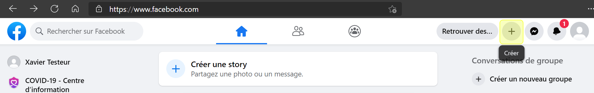

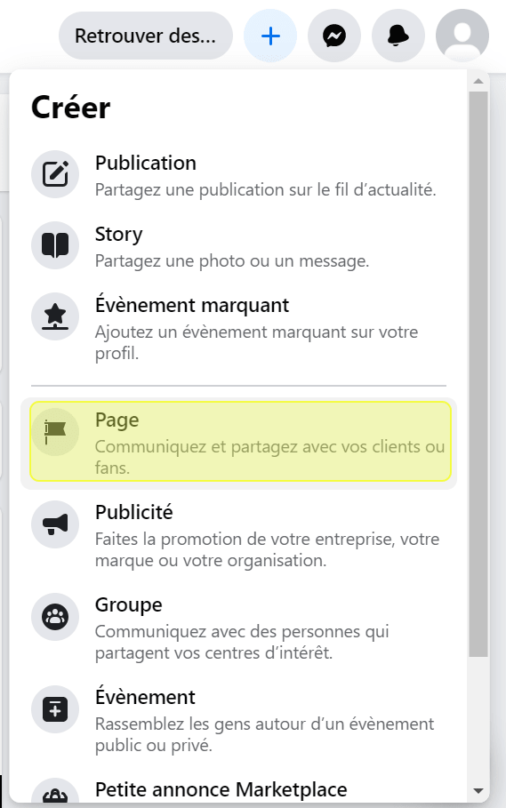

* Donnez-lui un nom (par exemple _My Tock Bot_)

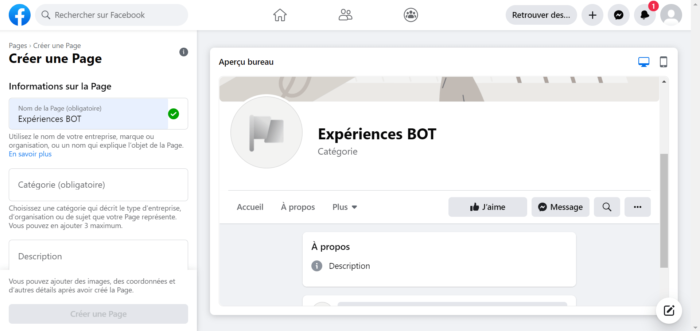

> Recommandation : ne publiez pas la page pour limiter son accès des utilisateurs Messenger : 
_Paramètres > Général > Visibilité de la page > **Non publiée**_

## Créer une application Facebook

* Allez sur la page [Facebook for developers > Voir toutes les applications](https://developers.facebook.com/apps/)

* _Ajouter une app_

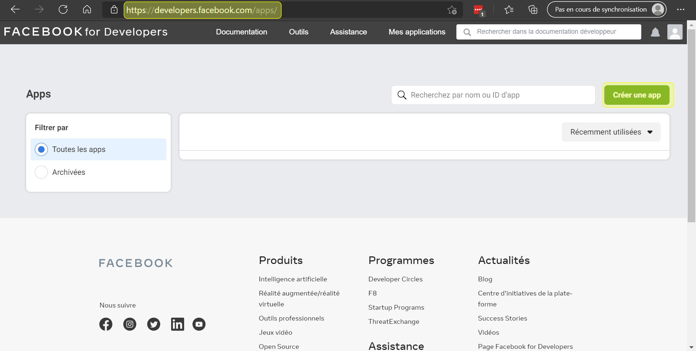

* _Créer une app_ > _Gérer les intégrations professionnelles_

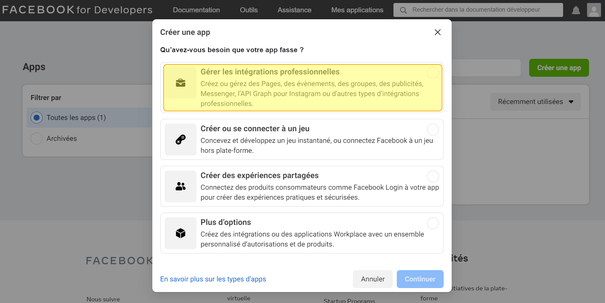

* Entrez un nom pour l'_application_

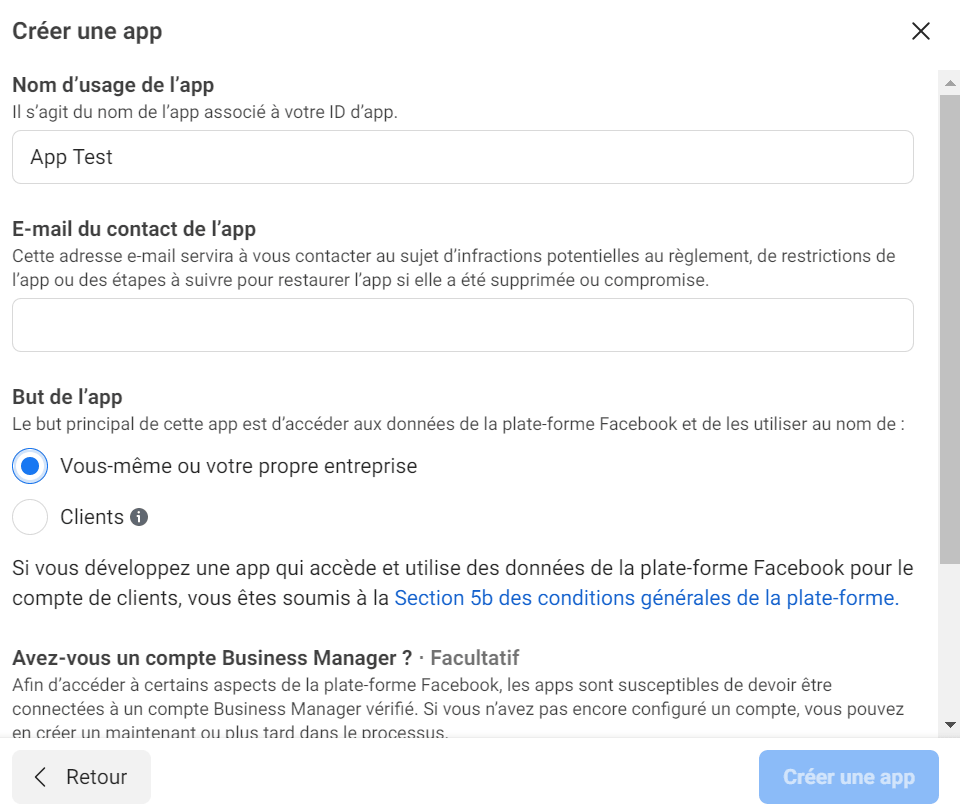

* Ajoutez un produit : _Messenger_

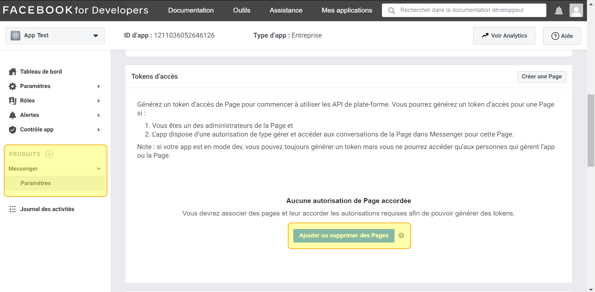

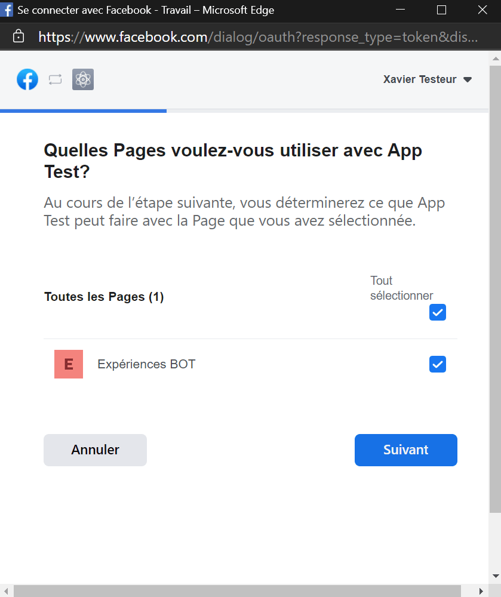

## Créer un connecteur Messenger

* Dans _Tock Studio_ allez dans _Settings_ > _Configurations_ :

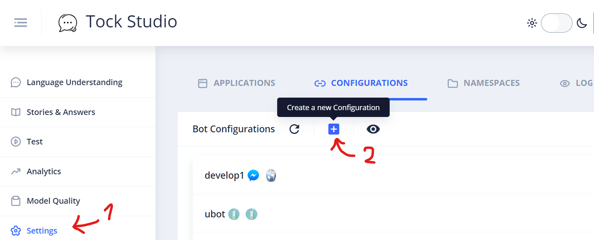

* Créez un connecteur de type _Messenger_ et ouvrez la section _Connector Custom Configuration_

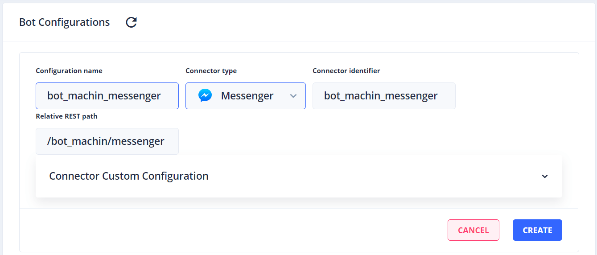

* Compléter les champs (voir ci-dessous champ par champ) :

  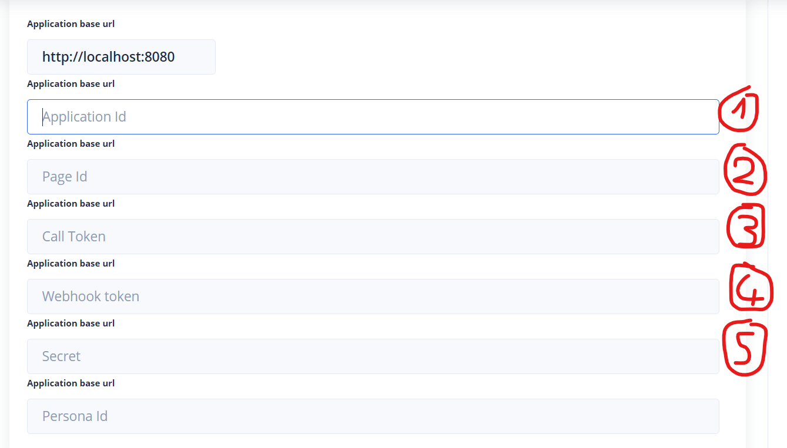

* _Application Id_ : il se trouve sur la page de votre application sur [https://developers.facebook.com](https://developers.facebook.com)

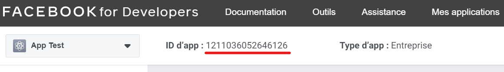

* _Page Id_ : il se trouve sur la page liée à votre application sur [https://facebook.com](https://facebook.com)

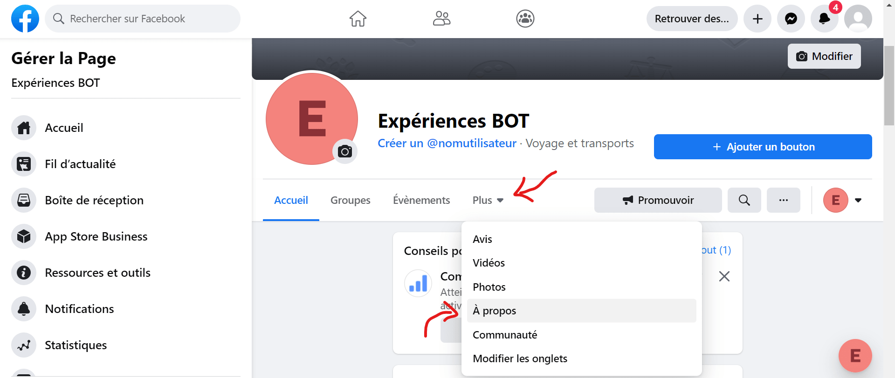

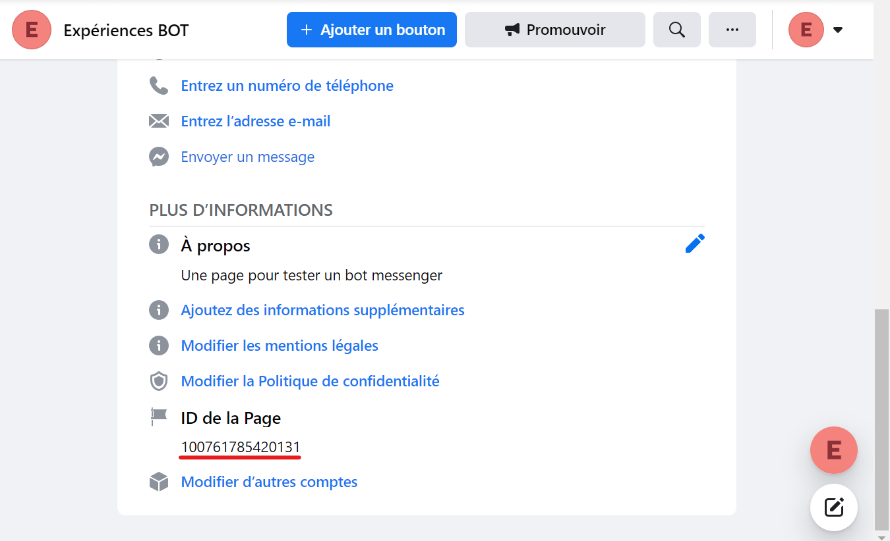

* _Call Token_ : le jeton se trouve sur la page de votre application sur [https://developers.facebook.com](https://developers.facebook.com)

* _Webhook Token_ : choisissez un jeton quelconque (même `token` si vous le souhaitez) et notez-le pour plus tard -
chaque appel de Facebook vers Tock passera ce jeton

* _Secret_ : à copier depuis la page de l'application sur [https://developers.facebook.com](https://developers.facebook.com)

* _Persona Id_ : vous pouvez laisser ce champ vide

* Vérifiez que la configuration du connecteur est bien enregistrée

## Configurer l'URL de rappel

* Retournez sur la page de configuration de votre application sur [https://developers.facebook.com](https://developers.facebook.com) :
  _Produits_ > _Messenger_ > _Paramètres_ > **_Webhooks_**

* Cliquez sur _Ajouter l'URL de rappel_ (ou _Modifier l'URL de rappel_ si vous aviez précédemment une autre URL)

* Entrez l'URL à laquelle votre connecteur Tock est actuellement déployé, et le jeton de webhook que vous avez choisi
  lors de la configuration du connecteur
  
> Pour retrouver l'URL de votre connecteur, allez sur la page de configuration _Tock Studio_ > _Settings_ > _Configurations_,
> déroulez la configuration de votre connecteur Messenger, et concaténez le contenu du champ _Application base url_ et celui du champ
> _Relative REST path_.
  
* Cliquez sur _Vérifier et enregistrer_

* Testez votre bot sur Messenger !

## Aller plus loin

Le modèle conversationnel, les fonctionnalités et la personnalité de votre assistant restent indépendants des canaux
sur lesquels le bot est présent. Vous pouvez néanmoins créer des réponses spécifiques à un canal : dans l'écran
_Answers_, avec des [règles de stories](../studio/stories-and-answers.md#story-rules) pour une configuration, ou avec les
composants Messenger des _DSLs_ et de la _Bot API_.

Pour en savoir plus sur le connecteur Messenger fourni avec Tock, rendez-vous dans le dossier
[connector-messenger](https://github.com/theopenconversationkit/tock/tree/master/bot/connector-messenger) sur GitHub,
où vous retrouverez les sources et le _README_ du connecteur.
