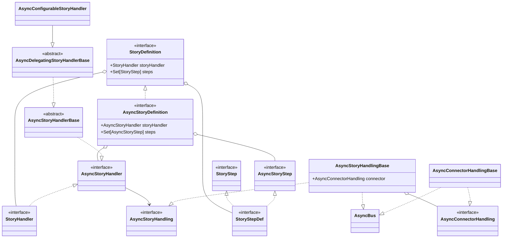

# Utilisation des coroutines dans les stories

!!! warning "Fonctionnalité expérimentale"
    L'API TOCK Coroutines est expérimentale. Elle peut contenir des bugs, ou changer (*breaking changes*) sans préavis.

Prérequis de lecture : [Bot intégré](../bot-integre.md)

Les classes relevant de l'API Coroutines de TOCK sont préfixées par `Async`. On retrouve une hiérarchie de classes
très similaire à celles de l'API Bot intégré :



Les classes qui nous intéressent particulièrement sont les suivantes :

- `AsyncStoryDefinition` : `StoryDefinition` spécialisée pour `AsyncStoryHandler` et `AsyncStoryStep`
- `AsyncBus` : équivalent de `Bus`
- `AsyncStoryHandlingBase` : équivalent de `StoryHandlerDefinitionBase`
- `AsyncConnectorHandlingBase` : équivalent de `ConnectorStoryHandlerBase`
- `AsyncStoryStep` : équivalent de `StoryStep`

Voici l'exemple donné pour le bot intégré, adapté pour cette nouvelle API, et avec une nouvelle fonctionnalité
d'affichage des trajets retour (pour démontrer les appels en parallèle) :

```kotlin
// The data required by the story to execute
private data class SearchArgs(
    val destination: Place,
    val origin: Place,
    val date: LocalDateTime,
    val returnDate: LocalDateTime?,
)

/**
 * This story takes an origin, a destination, a date and an optional return date and displays the first available itinerary
 */
// the story definition, specifying the primary and secondary intents, a handling class, and a precondition checker
val search = storyDef(
    "search", // Main starter intent and story identifier
    setOf(indicate_origin), // Other starter intent (starts the story if detected)
    setOf(indicate_location), // Secondary intent (keeps the story running if detected while in the story)
    handling = ::SearchHandling, // Constructor reference for your AsyncStoryHandling implementation
) { /* Precondition checker */
    // This code assumes that location, destination, origin, departureDate and returnDate are extension properties
    // on the AsyncBus

    // if the current intent is indicate_location and the location entity has a value, store the value
    // in the appropriate variable
    if (matchesIntent(indicate_location) && location != null) {
        if (destination == null || origin != null) {
            destination = returnsAndRemoveLocation()
        } else {
            origin = returnsAndRemoveLocation()
        }
    }    

    //check mandatory entities
    when {
        destination == null -> end("Pour quelle destination?")
        origin == null -> end("Pour quelle origine?")
        departureDate == null -> end("Quand souhaitez-vous partir?")
    }

    // args passed to the main handling class
    SearchArgs(destination, origin, departureDate, returnDate)
}

// Specify dedicated handling for two connectors via the following annotations.
// Your story can support as many or as few connectors as you want, among all those supported by the TOCK framework.
@GAHandler(GASearchConnector::class) // Connector-specific handling for Google Assistant
@MessengerHandler(MessengerSearchConnector::class) // Connector-specific handling for Facebook Messenger
class SearchHandling(bus: AsyncBus, private val args: SearchArgs) : AsyncStoryHandlingBase<SearchConnector>(bus) {

    override suspend fun answer() {
        // extract the args passed by the precondition checker
        val (d, o, date, returnDate) = args

        // First text message, with string interpolation
        send("De {0} à {1}", o, d)
        // Second text message, with string interpolation using a custom DateTimeFormatter
        send("Départ le {0}", date by datetimeFormat)
        // If the current connector supports it, the two messages above will be sent immediately, without waiting
        // for the API call below to complete.
        // This serves as a confirmation that the bot is processing the request before it can show the result.

        // Query in parallel our API for the journeys and the return journeys
        val (journeys, journeysBack) = coroutineScope {
            // First async call
            val journeys = async { SncfOpenDataClient.journey(o, d, date) }
            // Second async call, optional
            val journeysBack = returnDate?.let { async { SncfOpenDataClient.journey(d, o, it) } }
            // Wait for both calls to be finished
            Pair(journeys.await(), journeysBack?.await())
        }

        if (journeys.isEmpty()) {
            end("Désolé, aucun itinéraire trouvé :(")
        } else {
            send("Voici la première proposition :")
            // The calls to `c` below will fail with an NPE if you didn't specify an implementation for the current connector
            // To be null-safe, you can use the `connector` field instead
            if (journeysBack.isNullOrEmpty()) {
                // Not a round trip -> end with the one-way journey
                c.endWithJourney(journeys.first())
            } else {
                // Round-trip -> send both
                c.sendJourney(journeys.first())
                send("Voici le voyage retour :")
                c.endWithJourney(journeysBack.first())
            }
        }
    }
}

/** Handles connector-specific code (rich message creation) */
sealed class SearchConnector(context: SearchHandling) : AsyncConnectorHandlingBase<SearchHandling>(context) {

    // Utility method used in subclasses
    protected fun Section.title(): CharSequence = i18n("{0} - {1}", from, to)

    // Method used by the story
    fun sendJourney(journey: Journey) = send {
        journey(journey.publicTransportSections())
    }

    // Method used by the story
    fun endWithJourney(journey: Journey) = end {
        journey(journey.publicTransportSections())
    }

    // Implementation that generates a rich display message for a given list of sections
    protected abstract fun Bus<*>.journey(sections: List<Section>): ConnectorMessage

}

/** Implementation of our connector for the Messenger platform. The GA variant is left as an exercise to the reader. */
class MessengerSearchConnector(context: SearchDef) : SearchConnector(context) {

    override fun Bus<*>.journey(sections: List<Section>): ConnectorMessage =
        // Display our journey as a carousel
        genericTemplate(
            sections.map { section ->
                with(section) {
                    genericElement(
                        title(),
                        content(),
                        trainImage
                    )
                }
            }
        )
}
```
