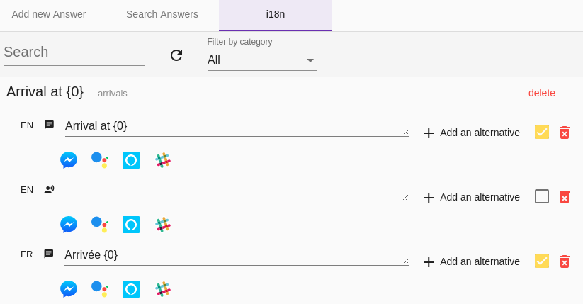

# Développer un bot multilingue (i18n)

La page [Bot multilingue](../../user/guides/i18n.md) de la documentation utilisateur présente les bases de l'internationalisation
(_i18n_) pour construire des bots avec Tock : pré-requis, _Locale_, etc.

Cette page vient compléter cette documentation avec des éléments propres au développement. 

## Pré-requis

Pour activer l'internationalisation dans Tock, programmatiquement ou pas, voir [Bot multilingue](../user/guides/i18n.md).

## Principes

Le code ne change pas une fois l'internationalisation activée. Par exemple : 

```kotlin
     send("Arrival at {0}", time)
```

est un code valide que le module soit activé ou non. 

Par contre, à l'exécution, le comportement diffère significativement.

Si l'internationalisation est activée, les opérations suivantes vont être effectuées :

1. Une clé va être générée à partir du texte passé en paramètre, en fonction du namespace (l'organisation du créateur du bot)
 et de la story dans laquelle est demandé ce libellé. Dans le cas ci-dessus, cela devrait ressembler à ```app_arrivals_Arrival at {0}``` où *app* est le namespace et 
*arrivals* l'intention principale de la story.

2. Tock vérifie ensuite si cette clé est déjà présente en base. 
    * Si c'est le cas, il utilise le libellé présent en base pour la langue demandée afin de trouver la traduction la plus appropriée (le connecteur ou le type d'interface peuvent également être pris en compte)
    * Sinon, une clé est créée en base avec le libellé par défaut ("Arrival at {0}" dans notre exemple) utilisée pour la langue courante
      * Si le texte passé en paramètre est un objet `I18nLabelValue` dont le champ `defaultI18n` contient une valeur pour la langue courante, celle-ci sera utilisée
  
3. Il est ensuite possible de consulter et de modifier ce libellé dans l'interface d'administration :   
  


## Format des messages

Le format supporté est celui du support i18n de java, en particulier celui de la classe [MessageFormat](https://docs.oracle.com/javase/10/docs/api/java/text/MessageFormat.html)
en java. Cela inclut le support de [ChoiceFormat](https://docs.oracle.com/javase/10/docs/api/java/text/ChoiceFormat.html) :

```kotlin
    send("There {0,choice,0#are no files|1#is one file|1<are {0,number,integer} files}.", 2)  
```

Par ailleurs, Tock met à disposition une extension *by* pour les dates qui permet d'indiquer un format dans les paramètres :

```kotlin
    send("Departure at {0}", departureDateTime by timeFormat) 
``` 

## Locale utilisateur

Voir [Bot multilingue](../user/guides/i18n.md).

## Points d'attention

Le module d'internationalisation de Tock est efficace, mais certaines pratiques, pourtant intuitives en Kotlin,
 sont à bannir sous peine de mauvaises surprises.

Par exemple, ce code fonctionne parfaitement bien avec le module i18n désactivé.

```kotlin
    send("There are $nb files") //DANGER!! 
```

mais pose problème si il est activé. En effet, un nouveau libellé sera créé pour chaque valeur différente de la variable *nb* !
 
S'il est nécessaire d'envoyer des réponses "à ne pas traduire", utilisez 
les méthodes *BotBus.sendRaw*, *BotBus.endRaw* ou *String.raw*

```kotlin
    send("There are $nb files".raw) //CORRECT 
``` 

```kotlin
    send("There are {0} files", nb) //FORMAT A SUIVRE 
```  

* Le risque de collision entre deux libellés est faible puisque l'intention principale de la story fait partie de la clé. 
Si vous souhaitez cependant éviter tout risque, vous pouvez utiliser la méthode *i18nKey* :

```kotlin
    send(i18nKey("my_unique_key", "There are {0} files", nb)) 
```  

### Spécification des localisations programmatiquement

Il est possible de définir des valeurs par défaut pour plusieurs localisations dans le code d'un bot :

```kotlin
    send(i18nKey("departure", "Departure at {0}", setOf(I18nLocalizedLabel(Locale.FRENCH, textChat, "Départ à {0}")), nb))
```

Par défaut, ces valeurs par défaut ne seront utilisées que lorsque la clé est utilisée pour la première fois. Pour écraser
les valeurs existantes (y compris celles définies via TOCK Studio) lorsque le paramètre `defaultI18n` est changé,
mettez la valeur de configuration `tock_i18n_reset_value_on_default_change` à `true` (soit en variable d'environnement,
soit en propriété système).

## Tester l'internationalisation

Un exemple de dispositif de test est disponible dans le
[code source du bot d'exemple](https://github.com/theopenconversationkit/tock-bot-open-data/tree/master/src/test/kotlin/rule)
Il est nécessaire d'étendre [l'extension de test](https://github.com/theopenconversationkit/tock-bot-open-data/blob/master/src/test/kotlin/rule/OpenDataJUnitExtension.kt)
pour ensuite indiquer la [correspondance des libellés](https://github.com/theopenconversationkit/tock-bot-open-data/blob/master/src/test/kotlin/rule/TranslatorEngineMock.kt) à tester.

Il ne reste plus qu'à indiquer la locale souhaitée : 

```kotlin

    @Test
    fun `search story asks for departure date WHEN there is a destination and an origin but no departure date in context`() {
        ext.newRequest("Recherche", search, locale = Locale.FRENCH) {
            destination = lille
            origin = paris

            run()

            firstAnswer.assertText("Quand souhaitez-vous partir?")
        }
    }
```  
