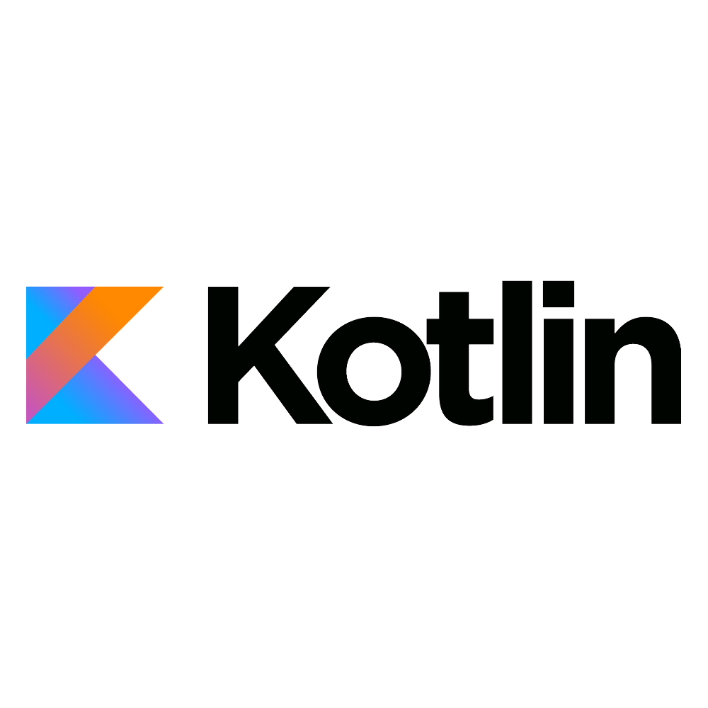
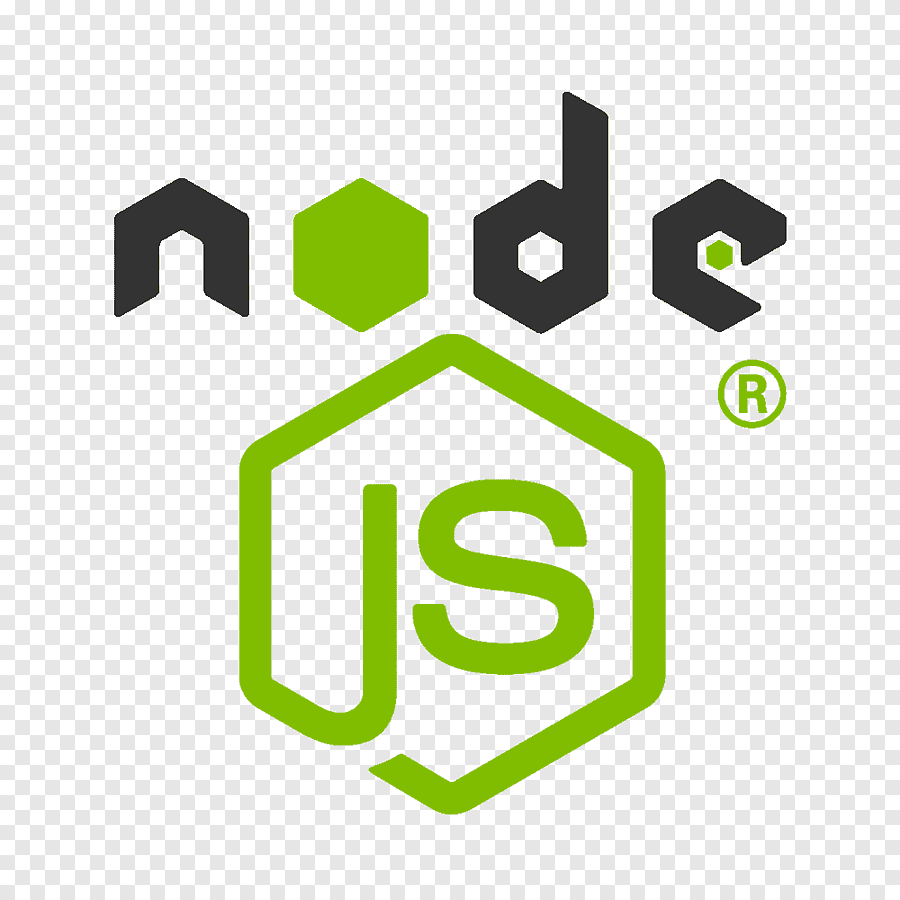
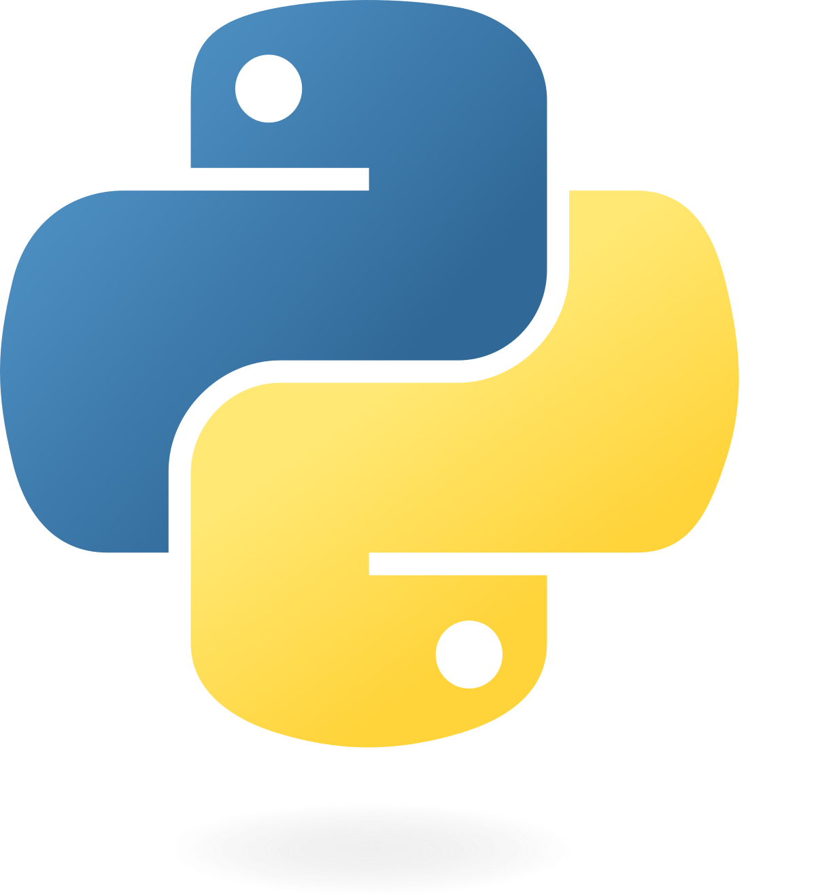
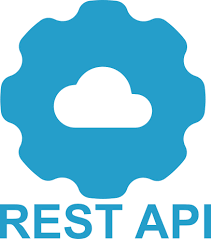
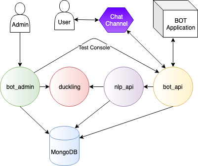
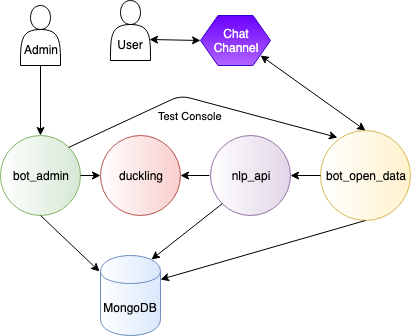

# Développer des bots avec Tock

_Tock Studio_ permet de construire des parcours conversationnels (ou _stories_) comprenant du texte, des boutons, des images,
des carrousels, etc. Pour aller plus loin, il est possible de programmer des parcours
en [Kotlin](https://kotlinlang.org/), [Javascript](https://nodejs.org/), [Python](https://www.python.org/)
ou d'autres langages.

{style="width:75px;"}
{style="width:75px;"}
{style="width:75px;"}
{style="width:75px;"}

## Choisir un mode de développement

Deux modes sont disponibles :

| | [_Bot API_](bot-api.md) (recommandé) | [_Bot intégré_](kotlin-bot.md) |
|---|---|---|
| Langages | Kotlin, Javascript/Node.js, Python, ou tout langage via l'API | Kotlin uniquement |
| Connexion à la plateforme | Via le service `bot_api` (_WebSocket_ ou _WebHook_) | Accès direct à la base MongoDB de la plateforme |
| [Plateforme de démo](https://demo.tock.ai/) | Disponible | Non disponible |
| Fonctionnalités | La plupart des fonctionnalités de Tock | Toutes les fonctionnalités de Tock, dont les [stories coroutines](coroutine-stories.md) |
| Mise en place | Simple : le bot n'a besoin que d'une clé d'API | Une plateforme Tock (en général avec [Docker](https://www.docker.com/)) et un accès partagé à MongoDB |

Choisissez le mode _Bot API_, sauf si vous avez besoin d'une fonctionnalité que seul le mode intégré fournit.

## Le mode _Bot API_

Le bot est une application qui se connecte au service `bot_api` de la plateforme, et reçoit les messages des utilisateurs
pour y répondre :

Voir la page [_Bot API_](bot-api.md).

## Le mode _Bot intégré_

Le mode de développement historique de Tock : le bot embarque le framework Tock et accède directement à la base
MongoDB. La plupart des bots construits par les concepteurs de Tock sont développés de cette manière.

Voir la page [_Bot intégré_](kotlin-bot.md).

## Aller plus loin

* [Internationalisation](i18n.md) des réponses
* [Tester](test.md) les stories
* [Créer un connecteur](connectors.md)
* [API](api.md) de la plateforme et de l'[orchestrateur Gen AI](../gen-ai/orchestrator-api.md)
* [Exemples de code](examples.md)
