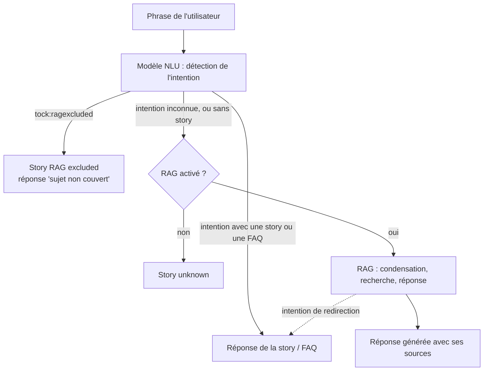

# Comment le bot répond : stories, FAQ et RAG

Un bot Tock combine deux façons de répondre :

* des **réponses déterministes** : les [stories](../studio/stories-and-answers.md) et les [FAQ](../studio/faq.md),
  écrites par vos équipes, déclenchées par l'intention que le modèle NLU détecte dans la phrase de l'utilisateur ;
* des **réponses générées** : le [RAG](rag.md), où un LLM rédige la réponse à partir de vos documents.

Pour chaque phrase, c'est le modèle NLU qui choisit entre les deux. Vous gardez ainsi la maîtrise des parcours
sensibles ou transactionnels (une réservation, une réclamation, un transfert vers un conseiller), et laissez le LLM
traiter la longue traîne des questions couvertes par vos documents.

## Traitement d'une phrase de l'utilisateur

Pour chaque phrase de l'utilisateur :

1. Le modèle NLU détecte l'intention de la phrase (voir [Compréhension du langage](../studio/nlu.md)).
2. Si une story (ou une FAQ) démarre avec cette intention, c'est elle qui répond : le LLM n'est pas appelé.
3. Si la phrase est qualifiée avec l'intention `tock:ragexcluded`, le bot répond avec sa story _RAG excluded_
   (par défaut : _« Sorry, I can't answer your question (Topic not covered) »_). Voir les [exclusions RAG](#exclure-des-sujets-du-rag).
4. Sinon, la phrase est inconnue ou son intention n'a pas de story : si le [RAG est activé](rag.md#activation-du-rag),
   le bot appelle l'[orchestrateur Gen AI](orchestrator-api.md), qui condense la question, recherche les documents
   et génère la réponse (voir le [fonctionnement du RAG](rag.md#fonctionnement)). Sans RAG, le bot répond avec sa
   story _unknown_.

## Garder la maîtrise des réponses générées

Plusieurs leviers, du plus léger au plus fort, encadrent ce que répond le LLM :

| Levier | Où | Effet |
|--------|----|-------|
| [Thèmes couverts et exclus, lexique métier](rag-prompt-context.md) | _Gen AI_ > _Rag prompt context_ | Injectés dans le prompt de réponse : le LLM doit rester dans les thèmes couverts |
| [Prompt de réponse](rag-prompt.md) | _Gen AI_ > _Rag settings_ | Règles du LLM : répondre uniquement à partir des documents, refuser les questions hors périmètre, résister à l'injection de prompt |
| [Réglages de recherche](rag.md#session-dindexation) et [compresseur](compressor.md) | _Gen AI_ > _Rag settings_, _Compressor settings_ | Choisir comment les documents sont retrouvés, et écarter les moins pertinents avant qu'ils n'atteignent le LLM |
| [Exclusions RAG](rag-exclusion.md) | _Language Understanding_ > _Inbox sentences_ | Le modèle NLU reconnaît les sujets exclus avant l'appel au LLM |
| [Stories et FAQ](../studio/stories-and-answers.md) | _Stories & Answers_ | Une réponse écrite, ou un parcours complet, remplace la réponse générée pour une intention donnée |

### Exclure des sujets du RAG

Une [exclusion RAG](rag-exclusion.md) qualifie une phrase avec l'intention `tock:ragexcluded`. Une fois le modèle NLU
entraîné avec suffisamment de phrases de ce type, les phrases proches sont reconnues comme exclues et n'atteignent
jamais le LLM. C'est plus sûr qu'une consigne dans le prompt, car la décision est prise avant l'appel au LLM.

### Répondre avec une story plutôt qu'avec le LLM

Quand une question appelle une réponse précise et validée, créez une [FAQ](../studio/faq.md) ou une
[story](../studio/stories-and-answers.md) : le modèle NLU détecte son intention et la story répond à la place du RAG.
Pour entraîner rapidement le modèle NLU sur une nouvelle FAQ, les phrases d'entraînement peuvent être
[générées par un LLM](sentence-generation.md).

### Rediriger du RAG vers une story

Le LLM de réponse peut aussi passer la main à une story. Quand sa réponse JSON contient une `redirection_intent`
(voir le [schéma de sortie du prompt](rag-prompt-reference.md#redirection_intent)), le bot envoie la réponse générée, puis bascule
sur la story démarrée par cette intention, par exemple un transfert vers un conseiller. L'intention doit avoir une story,
et ne peut pas être `unknown`.

### Restreindre les intentions suivantes

Au sein d'un parcours, une story peut restreindre les intentions détectables pour la phrase suivante de l'utilisateur
(voir [Restreindre le périmètre des intentions](../studio/intents-restrictions.md)) : les phrases attendues par le
parcours ne sont alors pas envoyées au RAG.

## Voir aussi

* [Améliorer les réponses](improve.md) : tester, diagnostiquer et mesurer la qualité des réponses générées.
* [Concepts](../concepts.md) : intentions, stories et vocabulaire de l'IA générative.
