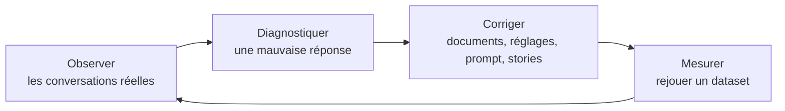

# Améliorer les réponses générées

Un bot RAG n'est jamais terminé du premier coup : les documents évoluent, les utilisateurs posent des questions
inattendues, et un changement de modèle ou de prompt peut améliorer certaines réponses et en dégrader d'autres.
Cette page décrit la boucle d'amélioration, et les outils de _Tock Studio_ utilisés à chaque étape.

## 1. Observer

* Le [_Dashboard_](../studio/dashboard.md) résume l'activité du RAG : part des réponses fondées sur les documents
  retrouvés, thèmes traités, état de la base de connaissances, vérifications de la configuration Gen AI.
* _Analytics_ > [_Dialogs_](../studio/analytics.md#longlet-dialogs) affiche les conversations, avec la réponse du RAG et
  ses sources. Elles peuvent être filtrées sur le statut de la réponse RAG, par exemple pour lister les questions
  traitées sans document pertinent. Activez _Dialogs debug_ dans les [réglages RAG](rag.md#activation-du-rag) pour
  enregistrer aussi la question condensée et les documents retrouvés.
* Le statut de la réponse RAG, le thème et les thèmes suggérés renvoyés par le LLM sont aussi enregistrés comme
  indicateurs (_RAG Status_, _RAG Topics_, _RAG Suggested Topics_), visibles dans le menu [_Metrics_](../studio/custom-metrics.md).
* Avec un [fournisseur d'observabilité](observability.md) comme Langfuse, chaque réponse renvoie vers la trace de
  ses appels au LLM : prompts exacts, documents, consommation de tokens et latence.
* Les [évaluations](answers-quality.md#evaluations) permettent aux experts métier de relire et noter un échantillon
  de conversations réelles.

## 2. Diagnostiquer

Depuis une réponse du bot dans _Analytics_ > _Dialogs_, des raccourcis ouvrent la question dans le diagnostic de
recherche ou dans le playground, avec les valeurs enregistrées pour cet échange. Identifiez d'abord où la chaîne a échoué :

| Symptôme | Cause probable | Outil |
|----------|----------------|-------|
| Le bon document ne fait pas partie des sources | **Recherche** : le document est absent de l'index, mal découpé ou trop mal classé | [Diagnostic de recherche](vector-store-inspection.md#diagnostic-de-recherche), [exploration de la base vectorielle](vector-store-inspection.md#exploration-de-la-base-vectorielle) |
| Le bon document fait partie des sources, mais la réponse est fausse ou incomplète | **Génération** : prompt, modèle ou taille du contexte | [Playground](playground.md), [traces d'observabilité](observability.md) |
| Le bot a répondu à une question qu'il n'aurait pas dû traiter | **Périmètre** : sujet non exclu, ou réponse validée manquante | [Exclusions RAG](rag-exclusion.md), [contexte du prompt](rag-prompt-context.md), [FAQ](../studio/faq.md) |
| Une question a été traitée par la mauvaise story | **NLU** : la phrase a été classée dans une intention qui a une story | [Compréhension du langage](../studio/nlu.md), [qualité du modèle](../studio/model-quality.md) |

## 3. Corriger

Selon la cause :

* **Documents** : complétez ou nettoyez les sources, puis [réindexez-les](indexing.md) et basculez le bot sur la
  nouvelle session d'indexation. L'[exploration de la base vectorielle](vector-store-inspection.md#exploration-de-la-base-vectorielle)
  signale les chunks presque vides, les sources sans URL et les titres en double.
* **Recherche** : changez le type de recherche (recherche hybride avec PGVector), le nombre de documents retrouvés
  dans les [réglages RAG](rag.md), ou le [compresseur](compressor.md). Comparez les recherches dans le diagnostic avant et après.
* **Génération** : ajustez le [prompt de réponse](rag-prompt.md) ou le modèle, après les avoir essayés dans le
  [playground](playground.md).
* **Périmètre** : ajoutez des [thèmes couverts ou exclus et des termes métier](rag-prompt-context.md),
  [excluez des phrases](rag-exclusion.md) du RAG, ou répondez avec une [FAQ](../studio/faq.md) ou une
  [story](../studio/stories-and-answers.md) (voir [Comment le bot répond](how-it-works.md)).

## 4. Mesurer

Avant de déployer une modification, vérifiez qu'elle ne dégrade pas d'autres réponses :

1. Constituez un [dataset](answers-quality.md#datasets) de questions représentatives, dont celles qui ont reçu une mauvaise réponse.
2. [Exécutez-le](answers-quality.md#executer-un-dataset) avant et après la modification, et
   [comparez les exécutions](answers-quality.md#comparer-des-executions).
3. Si besoin, [créez un échantillon d'évaluation à partir d'une exécution](answers-quality.md#creer-un-echantillon-a-partir-dune-execution)
   pour que les experts métier notent les nouvelles réponses.

L'[historique du _Dashboard_](../studio/dashboard.md#historique) garde la trace des modifications des réglages Gen AI
et du corpus, pour relier une évolution des métriques à un changement de configuration.
