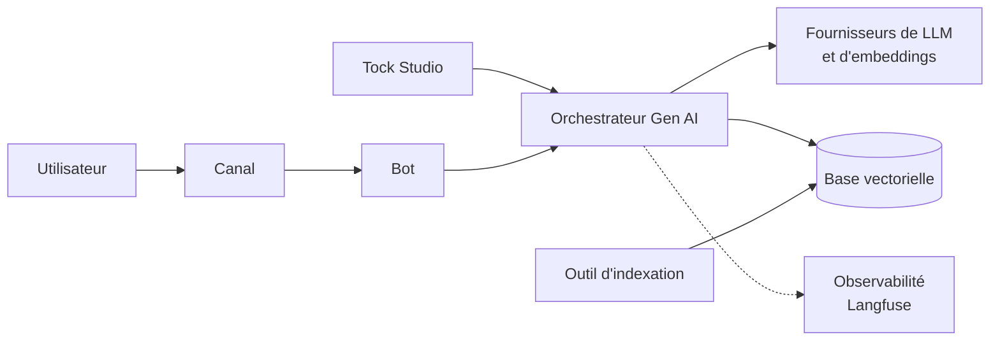

# Gen AI

Tock permet de construire des assistants conversationnels qui répondent à partir de **vos documents** avec un LLM
(RAG, _Retrieval-Augmented Generation_), tout en gardant la **maîtrise** de ce que dit l'assistant : les parcours
sensibles restent traités par des stories écrites par vos équipes, et la qualité des réponses générées est mesurée en continu.

Tout est open source et peut tourner sur votre propre infrastructure, avec le LLM, le modèle d'embeddings et la base
vectorielle de votre choix, y compris des modèles locaux.

Démo :

## Ce que vous pouvez faire

* **Répondre à partir d'une base de connaissances** : [indexez vos documents](indexing.md), puis laissez le
  [RAG](rag.md) répondre aux questions des utilisateurs, avec des liens vers les sources.
* **Garder la maîtrise des réponses** : combinez le RAG avec des [stories et des FAQ](how-it-works.md), définissez
  les [thèmes couverts et exclus](rag-prompt-context.md), [excluez des phrases](rag-exclusion.md), et rédigez un
  [prompt de réponse](rag-prompt.md) robuste.
* **Améliorer en continu** : [observez, diagnostiquez, corrigez et mesurez](improve.md) les réponses, avec les
  [traces d'observabilité](observability.md), le [diagnostic de recherche](vector-store-inspection.md),
  les [datasets et les évaluations](answers-quality.md).
* **Accélérer le modèle NLU** : [générez des phrases d'entraînement](sentence-generation.md) pour les FAQ.

## Mise en place

Pour l'essayer de bout en bout sur votre machine, suivez le tutoriel
[Construire un bot RAG sur la documentation Tock](../getting-started/rag-tutorial.md) (environ 30 minutes).

Sur votre propre plateforme :

1. Choisissez vos [fournisseurs de LLM et d'embeddings](providers/llm-embedding.md) et votre [base vectorielle](providers/vector-store.md).
2. [Indexez vos documents](indexing.md) dans la base vectorielle.
3. Configurez la [base vectorielle](vector-store.md) et le [RAG](rag.md) du bot dans _Tock Studio_.
4. Si besoin, configurez un [fournisseur d'observabilité](observability.md) pour tracer les appels aux LLM, et un
   [compresseur de documents](compressor.md).
5. [Testez et améliorez](improve.md) les réponses.

## Architecture

Les fonctionnalités Gen AI s'appuient sur l'**orchestrateur Gen AI**, un service Python
([FastAPI](https://fastapi.tiangolo.com/), [LangChain](https://www.langchain.com/)) déployé à côté de la plateforme Tock.
_Tock Studio_ et les bots l'appellent ; il appelle les fournisseurs de LLM, d'embeddings, de bases vectorielles et
d'observabilité configurés pour chaque bot.

* [Comment le bot répond](how-it-works.md) : comment le modèle NLU, les stories et le RAG fonctionnent ensemble.
* [API de l'orchestrateur Gen AI](orchestrator-api.md), sa [configuration](../operate/configuration.md#orchestrateur-gen-ai)
  et son [déploiement](../operate/architecture.md) sur votre plateforme.

## Menus de _Tock Studio_

| Je veux... | Menu de _Tock Studio_ | Page |
|------------|-----------------------|------|
| Connecter la base vectorielle | _Gen AI_ > _Vector DB settings_ | [Vector DB settings](vector-store.md) |
| Vérifier le contenu de la base de connaissances | _Gen AI_ > _Vector store exploration_ | [Inspection de la base vectorielle](vector-store-inspection.md#exploration-de-la-base-vectorielle) |
| Activer le RAG, choisir les modèles et les prompts | _Gen AI_ > _Rag settings_ | [Rag settings](rag.md) |
| Définir les thèmes couverts, les thèmes exclus et le lexique métier | _Gen AI_ > _Rag prompt context_ | [Rag prompt context](rag-prompt-context.md) |
| Filtrer les documents retrouvés (reranking) | _Gen AI_ > _Compressor settings_ | [Compressor settings](compressor.md) |
| Empêcher le RAG de répondre à certaines phrases | _Gen AI_ > _Sentences Rag exclusions_ | [Sentences Rag exclusions](rag-exclusion.md) |
| Essayer un prompt ou un modèle | _Gen AI_ > _Playground_ | [Playground](playground.md) |
| Comprendre pourquoi un document est (ou n'est pas) utilisé | _Gen AI_ > _Retrieval diagnostic_ | [Inspection de la base vectorielle](vector-store-inspection.md#diagnostic-de-recherche) |
| Tracer les appels aux LLM | _Gen AI_ > _Observability settings_ | [Observability settings](observability.md) |
| Mesurer la qualité des réponses | _Answers Quality_ | [Datasets et évaluations](answers-quality.md) |
| Générer des phrases d'entraînement pour les FAQ | _Gen AI_ > _Sentence generation settings_ | [Sentence generation settings](sentence-generation.md) |
