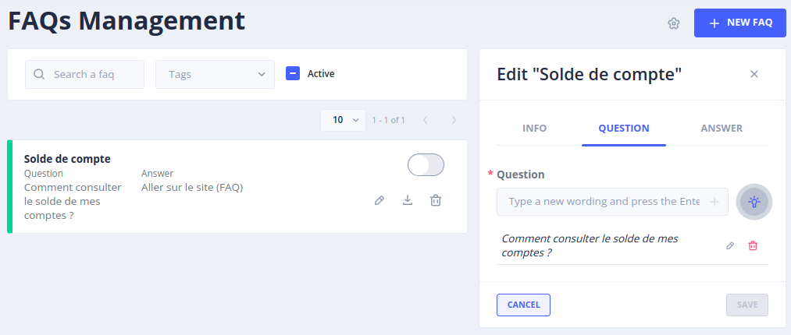
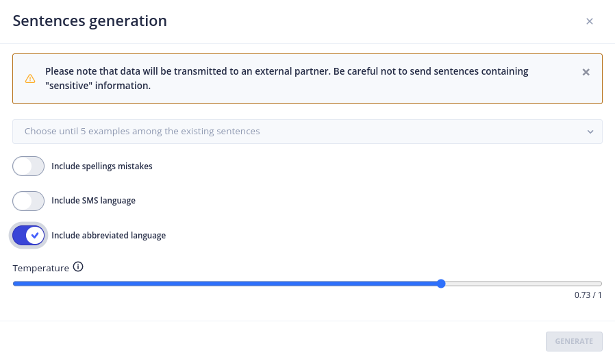

# Le menu _Sentence generation settings_

Le menu _Gen AI_ > _Sentence generation settings_ permet de configurer la fonctionnalité de génération de phrases d'entraînement pour les bots FAQ.

> Pour accéder à cette page il faut bénéficier du rôle **_admin_**.
>  (plus de détails sur les rôles dans [sécurité](../operate/security.md#roles)).

## Configuration

Pour activer la génération de phrases, renseignez :

* **Provider IA** : le LLM utilisé pour générer les phrases (voir la [liste des fournisseurs de LLM](providers/llm-embedding.md)),
* **Température** : la température par défaut, entre 0 (aucune latitude dans la création des phrases) et 1
  (la plus grande latitude) ; elle peut être modifiée au moment de la génération,
* **Prompt** : le prompt utilisé pour générer les phrases d'entraînement,
* **Nombre de phrases** : le nombre de phrases générées par chaque requête,
* **Activation** : active ou désactive la fonctionnalité.

## Utilisation

Pour utiliser la fonctionnalité de **Generate Sentences**, rendez-vous au menu _Stories & Answers_ > _FAQs stories_ :

1. Sélectionner **une ou plusieurs phrases** qui serviront de base d'entraînement.
2. Cliquer sur Modifier puis sur l'onglet **Question**
3. Cliquer sur **l’ampoule**, une fenêtre avec de nouveaux paramètres apparaît :

    

4. Choisir la ou les questions qui serviront de base d'entraînement.
5. Choisir si l’IA doit inclure des fautes d’orthographe, du langage de type SMS et des abréviations.
6. La température par défaut est celle qui a été choisie dans les Settings mais elle peut être modifiée ici selon le besoin.
7. Cliquer sur **Generate**.

L’IA va générer une liste de variantes de la question sélectionnée pour l'entraînement.
Sélectionner les variantes les plus appropriées à la requête et valider la sélection.

Les phrases  issues de la session d'entraînement apparaîtront alors dans les questions de la FAQ.
