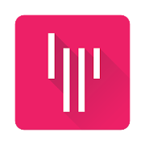
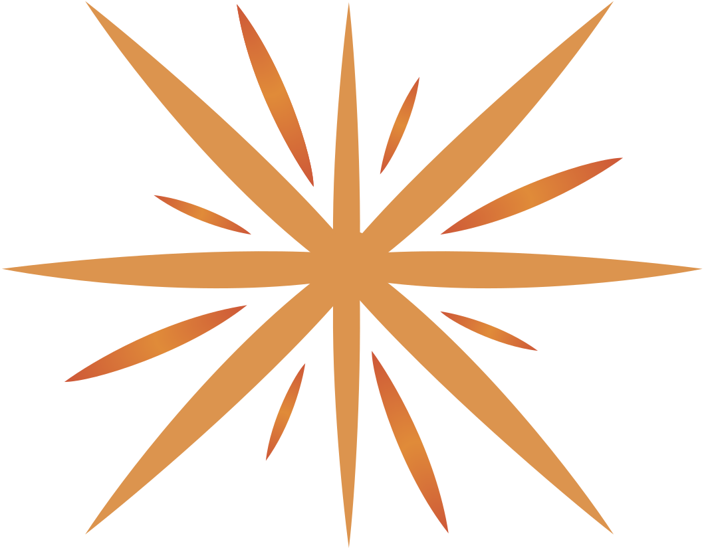

# Communauté Tock

Tock est bâti sur un modèle communautaire pour créer une plateforme ouverte.  
Pour en savoir plus, voir [pourquoi Tock](why.md).

La communauté Tock est ouverte à la contribution et tous les retours comme les _feature requests_ et 
_pull requests_ sont les bienvenus !

## Rejoindre la communauté (Gitter)

La plupart des utilisateurs et contributeurs Tock se retrouvent sur la messagerie instantannée 
 [Gitter](https://app.gitter.im/#/room/#tockchat_Lobby:gitter.im). C'est un bon moyen de voir à quel point la communauté est active et accessible.
 
* [Communauté Tock sur Gitter](https://app.gitter.im/#/room/#tockchat_Lobby:gitter.im)
* [Fil Gitter des releases Tock](https://app.gitter.im/#/room/#tockchat_tock-news:gitter.im)

<a href="https://app.gitter.im/#/room/#tockchat_Lobby:gitter.im"
target="gitter">
{style="width:75px;"}
</a>

## Suivre l'actualité de la plateforme

Pour suivre l'actualité des projets Tock mais aussi les meetups, conférences, etc.,
 rendez-vous sur le site principal :

* [Tock.ai](https://doc.tock.ai)

Vous pouvez également retrouver les nouveautés dans ces pages plus spécfiques :

* [Projets & utilisateurs connus](showcase.md)
* [Présentations & conférences](resources.md)
* [Prix & récompenses](showcase.md#recompenses)

Enfin, pour suivre les versions et fonctionnalités de Tock :

* [Fil Gitter des releases & features](https://app.gitter.im/#/room/#tockchat_tock-news:gitter.im)
* [Release Notes](https://github.com/theopenconversationkit/tock/releases)
* [Roadmap](https://github.com/theopenconversationkit/tock/milestones)

## Code & Contribution (GitHub)

L'ensemble de la plateforme et des outils est partagé sur 
[GitHub](https://github.com/theopenconversationkit/)
sous [licence Apache 2](https://github.com/theopenconversationkit/tock/blob/master/LICENSE).

* [Sources & Projets](https://github.com/theopenconversationkit/)
* [Licence](https://github.com/theopenconversationkit/tock/blob/master/LICENSE)
* [Issues](https://github.com/theopenconversationkit/tock/issues)
* [Contributeurs](https://github.com/theopenconversationkit/tock/graphs/contributors)

Pour en savoir plus sur l'organisation des dépôts, les conventions de code, etc. voir le  
[guide de contribution](contribute.md) Tock. Pour tout autre forme de contribution, n'hésitez pas à utiliser les [_issues_](https://github.com/theopenconversationkit/tock/issues) 
GitHub et à [contacter directement la communauté](https://app.gitter.im/#/room/#tockchat_Lobby:gitter.im) avec Gitter.

<a href="https://github.com/theopenconversationkit/tock/"

{style="width:100px;"}
</a>

## Association TOSIT

La solution Tock a été étudiée et expérimentée par l'association _TOSIT (The Open Source I Trust)_,
une structure de soutien à l'Open Source qui vise à soutenir l'émergence de codes, logiciels et
solutions informatiques sous licence open source et/ou licence libre.

> Fondée par Carrefour, EDF, Enedis, Orange, Pôle Emploi et SNCF, TOSIT compte depuis d'autres membres 
> importants comme Le Ministère des Armées, Société Générale ou MAIF par exemple.

Tock s'inscrit dans le cadre du Groupe de Travail _Chatbots_ du TOSIT.

La solution est d'ores et déjà utilisée par plusieurs membres du TOSIT, dont SNCF.

Pour en savoir plus, voir le site de l'association : [http://tosit.fr/](https://tosit.fr/)

{style="width:75px;"}

## Hébergement de la Démo publique

La plateforme publique de démonstration Tock est destinée à faciliter la prise en main de 
la solution. Elle est accompagnée d'un guide pour faire ses premiers pas. Merci à [e.Voyageurs SNCF](https://www.sncf.com/fr/groupe/newsroom/e-voyageurs-sncf) qui héberge et maintient cette 
plateforme de démo en ligne.

* [Plateforme Démo en ligne](https://demo.tock.ai/) 
* [Guide _Créer son 1er bot avec Tock_](../getting-started/first-bot-studio.md)

## Aide

Que ce soit pour de l'aide, des questions, des suggestions :  
n'hésitez pas à [nous contacter](#nous-contacter).

## Nous contacter

Développeurs, utilisateurs ou juste curieux, n'hésitez pas à contacter les créateurs de la solution et 
d'autres membres de la communauté pour échanger sur Tock.

* Vous pouvez nous retrouver sur ***Gitter*** (la messagerie 
instantannée pour GitHub) : 
[https://app.gitter.im/#/room/#tockchat_Lobby:gitter.im](https://app.gitter.im/#/room/#tockchat_Lobby:gitter.im)

<a href="https://app.gitter.im/#/room/#tockchat_Lobby:gitter.im"
target="gitter">

{style="width:100px;"}

* Les ***issues*** GitHub permettent aussi de remonter une anomalie ou proposer une évolution : 
[https://github.com/theopenconversationkit/tock/issues](https://github.com/theopenconversationkit/tock/issues)

<a href="https://github.com/theopenconversationkit/tock/issues"
target="issues">

{style="width:100px;"}
