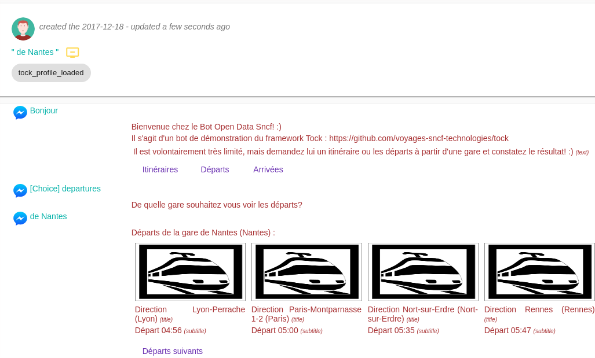

# Le menu _Analytics_

Ce menu contient une série d'onglets permettant de visualiser et d'analyser les cas d'utilisation du bot, des configurations, des stories et des intentions.

## L'onglet _Activity_

Cet écran permet de suivre différents indicateurs dans le temps :

* Nombre de messages reçus par le bot
* Messages par Story,
* Messages par Configuration,
* Messages par Connecteur,
* Etc.

Un calendrier permet de définir la période de temps à visualiser.

Chaque indicateur peut être vu de plusieurs manières :

* Histogramme
* Diagramme camembert (sur la période sélectionnée)
* Tableau triable
* Export CSV

L'onglet _Preferences_ permet de composer son propre tableau de bord, choisir ses indicateurs et les options de présentations.

## L'onglet _Behavior_

Cet écran présente d'autres indicateurs pour un période définie, sans pour autant représenter leur évolution :

* Type de messages reçus par le bot
* Canaux les plus utilisés
* Fréquentation horaire
* Fréquentation par jour de la semaine
* Etc.

Un calendrier permet de définir la période de temps à visualiser.

Chaque indicateur peut être vu de plusieurs manières :

* Diagramme camembert (sur la période sélectionnée)
* Tableau triable
* Export CSV

L'onglet _Preferences_ permet de composer son propre tableau de bord, choisir ses indicateurs et les options de présentations.

## L'onglet _Flow_

Cet écran permet d'analyser le _flot_ des intentions et des conversations :

* Flot des conversations (_Dynamic_ / _User Flow_) : analyse dynamique des parcours réellement effectués par les utilisateurs

* Flot des intentions (_Static_ / _Available Stories_) : analyse statique des parcours et arbres de décisions proposés par le bot

En développant l'interface (flèche à droite du cadre), de nombreux filtres apparaissent : focalisation sur une intention, transitions 
entrantes/sortantes, toutes les transitions ou seulement les plus représentatives en termes de trafic, etc.
 
## L'onglet _Users_

Cet onglet vous permet de voir les derniers utilisateurs connectés au bot :

* Nombre d'utilisateurs connectés
* Date du dernier échange avec un utilisateur
* Dernier message envoyé
* Etc.

En cliquant sur _Display dialog_, vous pouvez voir la conversation de cet utilisateur. 

## L'onglet _Dialogs_

Cet onglet liste les derniers dialogues du bot. Chaque dialogue peut être affiché en entier, avec le détail de chaque échange
(intention, scores NLU, réponse RAG et ses sources...).

Les options de recherche filtrent les dialogues selon :

* le texte des questions utilisateur (recherche partielle ou exacte),
* la période, la configuration, le connecteur, l'intention (ou masquer certaines intentions), l'identifiant du dialogue,
* le statut de la réponse RAG (par exemple, questions traitées avec ou sans documents pertinents),
* le retour utilisateur (feedback),
* les dialogues tenus depuis la vue de test de _Tock Studio_,
* les dialogues contenant des réponses RAG,
* les annotations : dialogues annotés uniquement, état et raison de l'annotation, date de création de l'annotation.

Depuis une réponse du bot, des raccourcis ouvrent la question dans le [playground](../gen-ai/playground.md) ou dans le
[diagnostic de recherche](../gen-ai/vector-store-inspection.md#diagnostic-de-recherche), avec les valeurs enregistrées pour cet échange.

### Annotations

Une _annotation_ signale et suit un problème sur une réponse du bot. Ouvrez l'annotation d'une réponse pour définir :

* son **état** : _Opened_, _Review needed_, _Resolved_ ou _Won't fix_,
* sa **raison** : question non ou mal comprise, réponse inexacte, réponse incomplète, sources / documents incomplets,
  sources / documents obsolètes, problème de lexique métier, mauvais format de réponse, hallucination ou autre,
* une **description**, et la **vérité terrain** (la réponse attendue).

Des commentaires peuvent être ajoutés, et chaque modification est conservée dans l'historique de l'annotation.
Les dialogues annotés se retrouvent ensuite avec les filtres d'annotation.

## L'onglet _Satisfaction_

Le module de satisfaction permet aux utilisateurs de noter leur expérience avec le bot. S'il n'est pas actif,
l'onglet propose de l'activer : 4 stories sont alors créées, et les utilisateurs peuvent noter le bot, par exemple en
demandant « Rate your experience ».

Une fois activé, l'onglet liste les dialogues notés avec la note moyenne, et permet de les exporter.

## L'onglet _Preferences_

Cet écran permet de configurer les tableaux de bords des vues _Activity_ et _Behavior_, à la fois 
les indicateurs/graphes à afficher mais également différentes options de présentations :
diagrammes en 3D, lissage des courbes, etc.

Une action permet à l'utilisateur de sauvegarder ses préférences.
