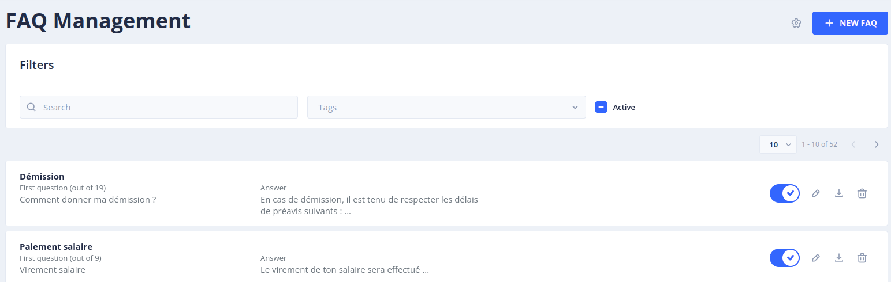
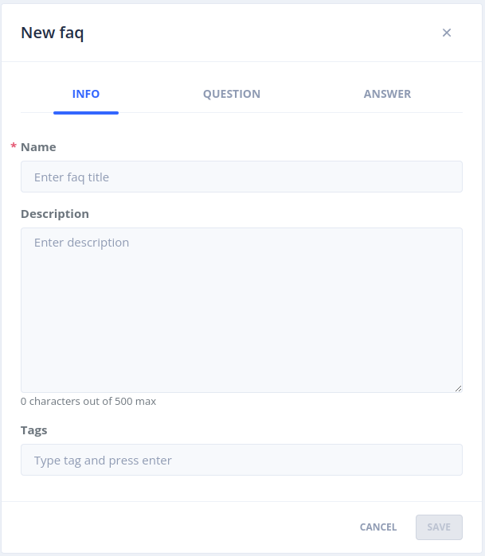
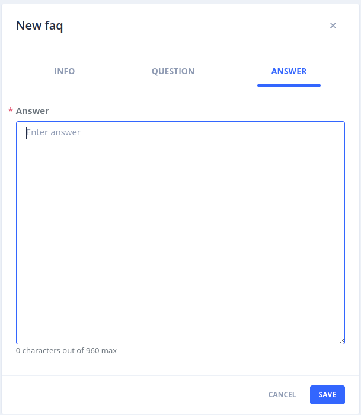

# FAQ

Le menu _Stories & Answers_ > _FAQs stories_ permet de créer, modifier et enrichir les modèles conversationnels avec
des _Foires Aux Questions_ : des questions avec une réponse simple (texte brut ou Markdown).

Il est destiné à un public métier non familier avec les concepts conversationnels (intentions, entités...).

> Pour accéder à cette page il faut bénéficier du rôle _botUser_ (plus de détails sur les rôles dans [sécurité](../operate/security.md#roles)).

## Liste des FAQ

Cette page liste l'ensemble des FAQ existantes (avec pagination).

Pour chaque FAQ vous retrouvez :

- Son nom
- La première question, et le nombre de questions associées
- Un extrait de la réponse renvoyée
- Un ensemble d'étiquettes (_tags_)

Les actions suivantes sont disponibles pour chaque FAQ :

- _Enable_ / _Disable_ : une fois désactivée, le bot n'envoie plus la réponse associée mais la réponse par défaut _unknown_
- _Test this question in a dialog_ : ouvre l'écran _Test_ avec la question
- _Edit_ : modifie les éléments de la FAQ (nom, description, étiquettes, questions, réponse)
- _Download_ : télécharge la FAQ au format JSON
- _Show story details_ : affiche la story associée à la FAQ
- _Delete_ : supprime la FAQ. L'intention sous-jacente est également supprimée, et ses questions retournent dans
  les _Inbox sentences_ de la [compréhension du langage](nlu.md).

Les boutons en haut de la page permettent de :

- _Import FAQs_ : importer des FAQ depuis un export JSON (voir plus bas)
- _Export all faqs_ : télécharger toutes les FAQ du bot au format JSON
- _Disable all_ : désactiver toutes les FAQ actives du bot
- _FAQ Parameters_ : configurer la question de satisfaction (voir plus bas)

### Filtres

Vous pouvez rechercher des FAQ en saisissant du texte dans le champ _Search_, les filtrer en sélectionnant une ou
plusieurs étiquettes, et limiter l'affichage aux FAQ actives, inactives ou à toutes avec la case _Active_.

## Créer une nouvelle FAQ

Vous pouvez créer une nouvelle FAQ en cliquant sur le bouton _+ New FAQ_.
Un panneau s'ouvre alors avec 3 onglets.

> Une story de type _Simple_ est automatiquement créée et associée à chaque nouvelle FAQ.

### Onglet _INFO_

Dans cet onglet, vous pouvez :

- Définir le nom de la FAQ
- Lui donner une description pour expliquer à quoi elle répond
- Ajouter des étiquettes pour regrouper les FAQ par thème

> Le nom de la FAQ sert à générer l'intention sous-jacente. Si une intention de ce nom est déjà utilisée par
> une autre application du namespace, vous pouvez la partager entre les deux applications ou en créer une nouvelle.

### Onglet _QUESTION_

Dans cet onglet, vous pouvez ajouter autant de questions que nécessaire pour alimenter le modèle.
Ces questions sont associées à l'intention sous-jacente de la FAQ.
Il est recommandé d'avoir au moins 10 questions aux formulations variées pour que le modèle atteigne un taux de reconnaissance minimal.

Le bouton _Generate sentences_ propose de nouvelles formulations générées par un LLM
(voir [génération de phrases](../gen-ai/sentence-generation.md)).

### Onglet _ANSWER_

Dans cet onglet, vous définissez la réponse envoyée à l'utilisateur quand sa question correspond à la FAQ :

- Le format de la réponse : texte brut ou Markdown (si le canal le permet)
- Le contenu de la réponse, qui peut être différent pour chaque combinaison locale / connecteur / interface
- Des notes de bas de page optionnelles (titre, URL, contenu), affichées comme sources sous la réponse

## Qualifier les phrases des utilisateurs

Les phrases envoyées par les utilisateurs se qualifient dans _Language Understanding_ > _Inbox sentences_,
comme toute autre phrase (voir [Compréhension du langage](nlu.md)) : l'intention de chaque FAQ apparaît dans la liste des intentions.
Valider une phrase avec l'intention d'une FAQ l'ajoute aux questions de cette FAQ.

## Importer des FAQ

Le bouton _Import FAQs_ importe un fichier JSON produit par _Export all faqs_, par exemple pour copier des FAQ d'un bot à un autre.

## Question de satisfaction

Le bouton _FAQ Parameters_ permet de configurer une story exécutée après la réponse d'une FAQ, pour recueillir
la satisfaction de l'utilisateur sur la qualité de la réponse.

Cochez la case _Ask for satisfaction after answering on FAQ question_, puis choisissez une story dans la liste _Select story_.

> Une [règle](stories-and-answers.md#story-rules) de type _Ending_ est automatiquement créée entre la story de chaque FAQ et la story sélectionnée.
