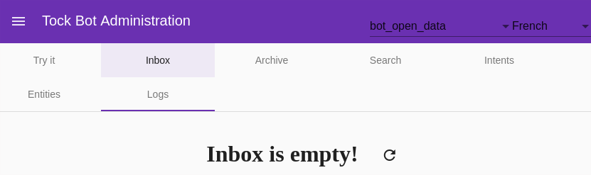

# Construire les modèles conversationnels

La documentation _Tock Studio_ peut être parcourue écran par écran, notamment les menus _Language Understanding_
et _Model Quality_ pour la gestion des modèles conversationnels. N'hésitez pas à vous y référer si vous 
avez une question sur un onglet / une option en particulier.

Cette page présente la construction des modèles en se focalisant plus sur l'usage et l'apprentissage, 
s'autorisant à passer d'un écran à un autre sans détailler exhaustivement chaque fonctionnalité de la plateforme.

> Notez qu'il est possible de déployer la plateforme Tock NLU seule, dans ce cas les interfaces graphiques Tock 
>se limitent aux menus _Settings_, _Language Understanding_ et _Model Quality_. Cette page peut donc servir de tutoriel pour une utilisation 
>de Tock restreinte au _Language Understanding_, par exemple pour un usage comme l'[Internet des objets](https://fr.wikipedia.org/wiki/Internet_des_objets).

## Rendez-vous dans la section *Language Understanding*

Le menu _Language Understanding_ renvoie sur l'onglet _Inbox_ par défaut. Au départ vous n'avez pas de phrases si personne n'a encore parlé au bot :

## Ajoutez et qualifiez des phrases

### Ajoutez une phrase

* Rendez-vous dans l'écran _New Sentence_
* Saisissez une phrase

## Créez une nouvelle intention

* Attribuez à la phrase une nouvelle intention en sélectionnant _Create a New Intent_ dans la liste de sélection _Intent_.

 
### Spécifiez des entités
 
Selon ce à quoi est destinée l'intention, vous pouvez spécifier les entités que vous souhaitez que votre modèle reconnaisse
dans la phrase :

* Sélectionnez une portion de phrase correspondant à l'entité (ie. un groupe de mots à sélectionner avec la souris)
* Cliquez sur _Add Entity_ qui vient d'apparaître

 
* Choisissez un type d'entité existant ou créez-en un nouveau
* Donnez un rôle à cette entité

> Exemple : dans la phrase "je veux aller de Paris à New York", probablement que Paris et New York sont deux entités 
>du même type (localité) mais n'ont pas le même rôle dans l'intention (origine et destination).

Il est bien sûr possible d'avoir plusieurs occurrences du même role, ou d'un rôle différent dans la même phrase.

### Tirez parti des *entités prédéfinies*

Par défaut, Tock propose un certain nombre de types d'_entités prédéfinies_, notamment les types supportés par la bibliothèque
[Duckling](https://github.com/facebook/duckling) : montants, dates, etc. Si vous sélectionnez ces types d'entités, 
celles-ci seront automatiquement reconnues et valorisées.
 

### Validez la phrase

Lorsque l'intention et les entités sont correctes, terminez la qualification de la phrase en cliquant sur _Validate_. 

### Qualifiez d'autres phrases

Après deux ou trois phrases pour une intention donnée, il est courant que le modèle commence à reconnaître 
les phrases suivantes et détectent bien l'intention (avec un score grandissant, du moment que les 
phrases sont relativement proches / en rapport avec l'intention bien sûr) :

Si une phrase n'est pas bien qualifiée, changez l'intention / les entités puis faites _Validate_ pour appliquer 
la correction. Si la phrase était bien qualifiée, faites directement _Validate_.

Dans les deux cas, vous alimentez ainsi le modèle, qui se reconstruit, et devient plus pertinent pour les 
pharses suivantes.

Vous êtes en train de construire votre modèle conversationnel !

C'est le début de l'**apprentissage** pour votre bot ou votre application conversationnelle.

> La qualification de phrases, leur nombre mais aussi leur variété (notamment dans le temps, car les utilisateurs d'aujourd'hui ne sont 
pas exactement les utilisateurs de demain) sont la base d'un **modèle pertinent** et d'une **bonne expérience** conversationnelle 
pour les utilisateurs. 

## Parcourez les phrases du modèle

L'onglet _Search_ permet de parcourir l'ensemble des phrases du modèle en utilisant un certain nombre de critères.
Le plus utilisé est la recherche texte simple pour lequel il est également possible d'utiliser des expressions régulières.

Chaque phrase à un état _Status_ qui peut évoluer au cours du temps :

* _Inbox_ : La phrase n'a pas encore été qualifiée et ne fait pas partie du modèle
* _Validated_ : La phrase a été validée mais n'est pas encore pris en compte dans les modèles de NLP (cela peut prendre du temps dans le cas de modèles de taille importante)
* _Included in model_ : La phrase a été validée et a été prise en compte dans les modèles de NLP

Cet écran permet donc de consulter les phrases faisant déjà partie du modèle (autrement dit déjà qualifiés),
 et de faire évoluer les qualifications de phrases au cours du temps. Il est notamment possible 
 de re-qualifier tout un groupe de phrases.

> Par exemple, vous pourrez créer une nouvelle intention plus tard et décider que toutes les phrases remplissant 
>un certain critère (mot-clef ou autre) devront dorénavant être qualifiées dans cette nouvelle intention.

## Modifiez les caractéristiques avancées de l'application

Le menu _Applications_ donne accès à la liste des applications/bots disponibles sur la plateforme :

Avec le bouton de modification, plusieurs options sont disponibles, en particulier :

### La sélection du moteur NLU

Vous avez la possibilité de sélectionner la bibliothèque NLU utilisée par ce bot 
(à condition que plusieurs moteurs soient présents dans l'installation de la plateforme).

### L'activation des modèles d'entités

Cette option permet de réutiliser des modèles d'entités pré-construits dans vos nouvelles intentions. 
Par exemple, si vous créez une intention avec une entité `duckling:datetime`, 
les dates seront automatiquement reconnues pour cette intention dans tous les nouvelles phrases attribuées à cette 
intention.

> En interne, un arbitrage est effectué entre les informations provenant des modèles d'entités pré-construits et les 
>informations tirées de votre propre modèle.

Cette option est activée par défaut. Il peut être utile de la désactiver pour les modèles de taille très importante, 
pour lesquels la détection native sera supérieure dans quasiment tous les cas à celle des modèles d'entités. 

### L'activation des sous-entités

Si vous activez cette option, vous pourrez qualifier plusieurs niveaux d'entités :

Le nombre de niveaux n'est pas limité, mais il est conseillé de ne pas en spécifier plus de 3 ou 4.

### Valeurs prédefinies d'entités

Une entité donnée peut avoir des _valeurs prédéfinies_. Pour cela vous devez aller dans l'onglet _Entities_, 
selectionnez une entité. L'icône à coté de l'icône de suppression montre les types d'entités que vous pouvez modifier :

Dans l'exemple ci-dessus, deux labels sont définis pour la valeur de semaine :
 
 * Semaine
 * hebdomadaire

## Continuer...

Pour en savoir plus sur la gestion des entités, notamment dans des intentions créées programmatiquement, 
out tout simplement pour continuer de parcourir le manuel utilisateur Tock, 
vous pouvez vous rendre dans le chapitre [Développement](../../dev/modes.md).