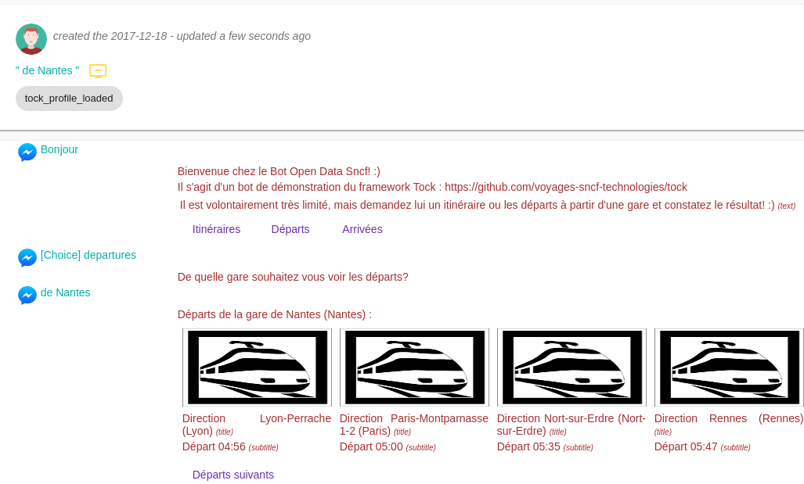

# Le menu _Analytics_

Ce menu contient une série d'onglets permettant de visualiser et d'analyser les cas d'utilisation du bot, des configurations, des stories et des intentions.

Le menu _Monitoring_ permet de suivre et observer les utilisateurs connectés ainsi que les conversations.

## L'onglet _Activity_

Cet écran permet de suivre différents indicateurs dans le temps :

* Nombre de messages reçus par le bot
* Messages par Story,
* Messages par Configuration,
* Messages par Connecteur,
* Etc.

Un calendrier permet de définir la période de temps à visualiser.

Chaque indicateur peut être vu de plusieurs manières :

* Histogramme
* Diagramme camembert (sur la période sélectionnée)
* Tableau triable
* Export CSV

L'onglet _Preferences_ permet de composer son propre tableau de bord, choisir ses indicateurs et les options de présentations.

## L'onglet _Behavior_

Cet écran présente d'autres indicateurs pour un période définie, sans pour autant représenter leur évolution :

* Type de messages reçus par le bot
* Canaux les plus utilisés
* Fréquentation horaire
* Fréquentation par jour de la semaine
* Etc.

Un calendrier permet de définir la période de temps à visualiser.

Chaque indicateur peut être vu de plusieurs manières :

* Diagramme camembert (sur la période sélectionnée)
* Tableau triable
* Export CSV

L'onglet _Preferences_ permet de composer son propre tableau de bord, choisir ses indicateurs et les options de présentations.

## L'onglet _Flow_

Cet écran permet d'analyser le _flot_ des intentions et des conversations :

* Flot des conversations (_Dynamic_ / _User Flow_) : analyse dynamique des parcours réellement effectués par les utilisateurs

* Flot des intentions (_Static_ / _Available Stories_) : analyse statique des parcours et arbres de décisions proposés par le bot

En développant l'interface (flèche à droite du cadre), de nombreux filtres apparaissent : focalisation sur une intention, transitions 
entrantes/sortantes, toutes les transitions ou seulement les plus représentatives en termes de trafic, etc.
 
## L'onglet _Users_

Cet onglet vous permet de voir les derniers utilisateurs connectés au bot :

* Nombre d'utilisateurs connectés
* Date du dernier échange avec un utilisateur
* Dernier message envoyé
* Etc.

En cliquant sur _Display dialog_, vous pouvez voir la conversation de cet utilisateur. 

## L'onglet _Search_

A l'instar de la vue _Users_, cette écran permet d'observer les dernières conversations.

Il est possible de les filtrer par connecteur, intention, etc.

## L'onglet _Preferences_

Cet écran permet de configurer les tableaux de bords des vues _Activity_ et _Behavior_, à la fois 
les indicateurs/graphes à afficher mais également différentes options de présentations :
diagrammes en 3D, lissage des courbes, etc.

Une action permet à l'utilisateur de sauvegarder ses préférences.

## Continuer...

Rendez-vous dans [Menu _Model Quality_](../../user/studio/nlu-qa.md) pour la suite du manuel utilisateur. 

> Vous pouvez aussi passer directement au chapitre suivant : [Développement](../../../dev/modes.md). 
