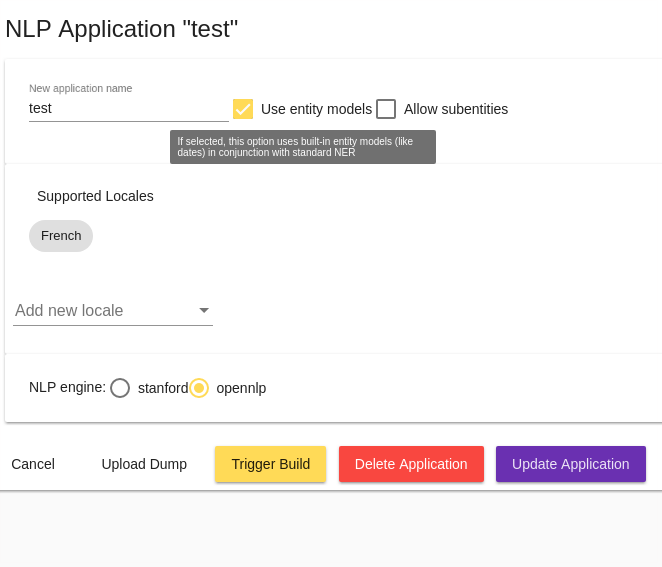

# Le menu *Settings*

Le menu _Settings_ permet de créer et paramétrer les applications conversationnelles Tock (c'est-à-dire les  
modèles / bots pouvant co-exister sur une plateforme). Plusieurs fonctions d'administration et de configuration des 
bots sont également disponibles via ce menu : importer/exporter une configuration, paramétrer la langue, les connecteurs, etc.

## L'onglet *Applications*

Cet écran permet de créer, modifier, supprimer des applications conversationnelles Tock.

> Lors de la première connexion à la [plateforme de démonstration](https://demo.tock.ai/),
>un assistant simplifié permet de créer la première application (le premier bot). Par la suite, vous pouvez passer par 
>cet écran pour ajouter d'autres applications.

### Creer une application

Pour ajouter une application, cliquez sur _Create New Application_ :

* Saisissez un nom / identifiant pour l'application

* Choisissez si le modèle pourra inclure des _entités_ voire des _sous-entités_ (cf [Concepts](../concepts.md) pour en savoir plus)

* Sélectionnez une ou plusieurs langues (voir [Construire un bot multilingue](../guides.md) pour en savoir plus)

* Sélectionnez un moteur NLU ([Apache OpenNLP](https://opennlp.apache.org/) ou [Stanford CoreNLP](https://stanfordnlp.github.io/CoreNLP/), 
voir [Installation](../../admin/installation.md) pour en savoir plus)

### Modifier, importer et exporter une application

Pour chaque application déjà créée, vous pouvez par la suite :

* _Download an application dump_ : télécharger sa configuration au format JSON : langue, modèle intentions/entités, etc.

* _Download a sentences dump_ : télécharger ses phrases qualifiées au format JSON

* _Edit_ : modifier la configuration de l'application
    * Un formulaire permet de modifier la configuraion initiale
    * Une section _Advanced options_ ajoute d'autres paramètres pour les utilisateurs avertis :
        * _Upload dump_ : charger une configuration ou des phrases qualifiées à partir d'un fichier au format JSON.
         Seules les nouvelles intentions/phrases seront ajoutées, cette fonction ne modifie pas / ne supprime pas 
        les intentions/phrases existantes
        * _Trigger build_ : déclencher/forcer la reconstruction du modèle
        * _NLU Engine configuration_ : paramétrer finement le moteur NLU sous-jacent (les paramètres dépendant du moteur
        utilisé, [Apache OpenNLP](https://opennlp.apache.org/) ou [Stanford CoreNLP](https://stanfordnlp.github.io/CoreNLP/))
        * _Alexa Export_ : exporter le modèle Tock dans un format utilisable par [Alexa](https://alexa.amazon.com/)

La fonction _Upload dump_ (voir ci-dessus) est également accessible directement en bas d'écran, permettant :

* Soit de modifier une application (si l'`application name` existe)
* Soit d'en créer/importer une nouvelle

## L'onglet *Configurations*

Cet écran permet d'accéder aux _connecteurs_ d'un bot, d'en ajouter, modifier ou supprimer. C'est aussi là que vous trouvez 
les informations pour se connecter programmatiquement.

### Se connecter programmatiquement au bot

Le paramétrage pour se connecter au bot programmatiquement (ie. via un programme / langage de programmation) 
se trouve dans cet écran :

* L'_API Key_ peut être copiée et embarquée dans le code client de la _Bot API_ pour connecter des parcours programmés 
en Kotlin ou dans un autre langage de programmation comme Javascript/Nodejs ou Python

* Une adresse / URL peut être configurée pour utiliser le mode _WebHook_ de _Bot API_

Pour en savoir plus sur ces paramètres et le développement de parcours, voir [Bot API](../../dev/bot-api.md).

### Gerer les connecteurs

La liste des _connecteurs_ du bot est affichée sous la clef d'API. Pour ajouter un connecteur au bot, cliquez sur
_Create a new Configuration_.

Tous les connecteurs possèdent la configuration suivante :

* _Configuration name_ : le nom/identifiant du bot
* _Connector type_ : le type de canal (par exemple Messenger, Slack, etc.)
* _Connector identifier_ : un identifiant pour le connecteur, unique pour le bot
* _Relative REST path_ : un chemin relatif unique pour la plateforme, pour communiquer avec le bot sur ce canal.

> Par défaut, le chemin est de la forme `/io/{organisation}/{application}/{canal}` ce qui le rend unique sur la plateforme 
>(à moins que deux connecteurs du même type soient déclarés pour le même bot). 

Chaque connecteur possède également une configuration supplémentaire spécifique à ce type de connecteur. Ces paramètres 
sont dans _Connector Custom Configuration_. Ces paramètres spécifiques sont documentés avec chaque type de connecteur/canal, 
voir [Les connecteurs](../../user/guides/canaux.md).

### Connecteurs de test

Pour chaque connecteur ajouté au bot, un _connecteur de test_ est aussi créé et configuré. Il sert à "simuler" le connecteur
lorsqu'on teste le bot directement dans l'interface _Tock Studio_ (menu _Test_ > _Test the bot_).

Par défaut, les connecteurs de test ne sont pas affichés dans l'écran _Bot Configurations_. Cliquez sur _Display test 
configurations_ pour les voir et éventuellement les modifier.

> En particulier, si vous obtenez des messages d'erreur de connexion dans la page _Test the bot_, n'hésitez pas à 
>vérfier la configuration de test notamment l'adresse _Application base url_ (pour une plateforme déployée avec Docker 
>Compose par défaut, ce devrait être `http://bot_api:8080` avec le nom du conteneur et le port déclarés 
>dans le descripteur `docker-compose-bot.yml`).

## L'onglet *Namespaces*

Cet écran permet de gérer un ou plusieurs espaces de nommage ou _namespaces_. Chaque application, chaque bot est créé 
au sein d'un namespace. Il est possible de gérer plusieurs namespaces, et de partager certains d'entre eux avec 
une équipe ou d'autres utilisateurs Tock Studio. Pour cela, il suffit d'éditer le namespace et d'ajouter d'autres 
utilisateurs (en leur donnant plus ou moins de droits sur le namespace).

## L'onglet *Log*

Cette vue permet de suivre les principales modifications de configuration applicative effectuées 
par les utilisateurs via Tock Studio: création d'applications, modifications des connecteurs, imports, etc.

## Continuer...

Rendez-vous dans [Menu _FAQ Training_](faq-training.md) pour la suite du manuel utilisateur. 

> Vous pouvez aussi passer directement au chapitre suivant : [Développement](../../../dev/modes.md).    