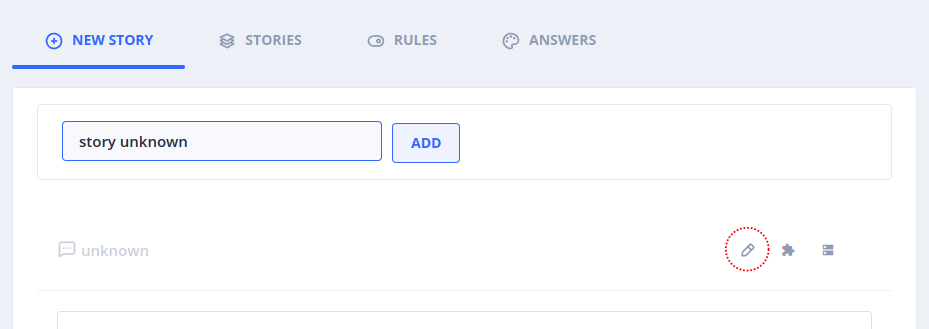
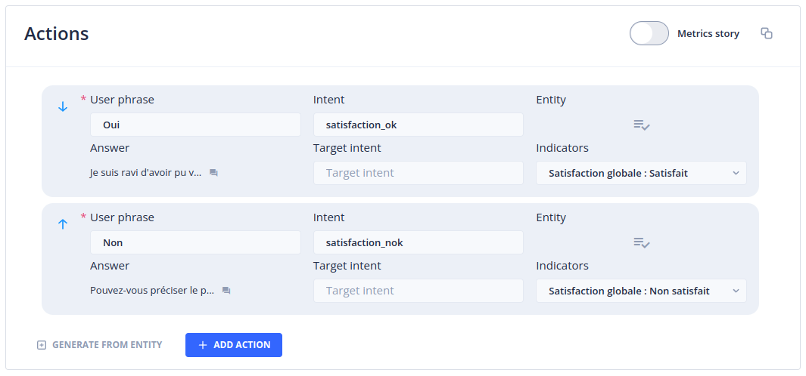
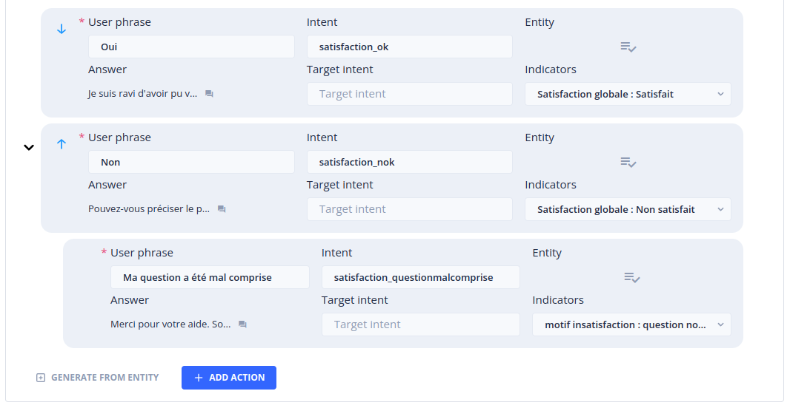
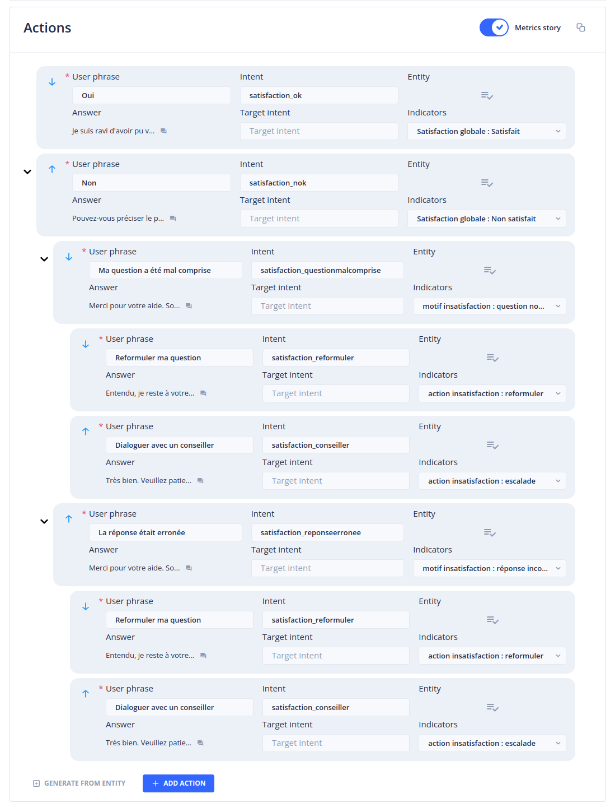
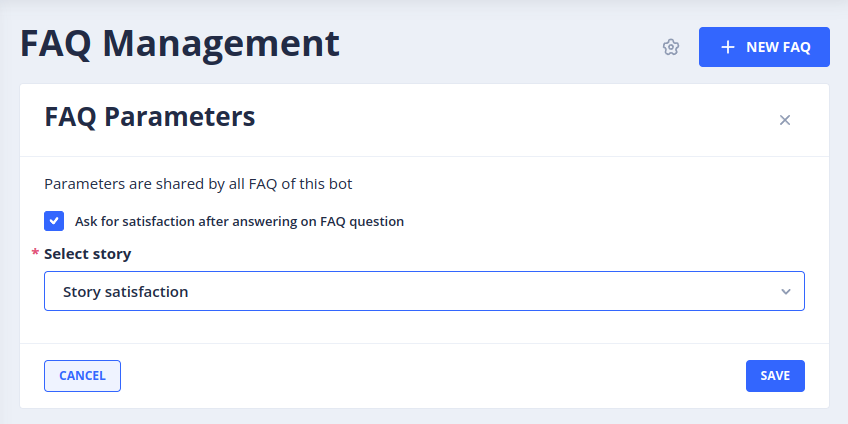

# Le menu _Custom Metrics_

Le menu _Custom Metrics_ permet de créer et visualiser des statistiques de consultation et d'usage des stories Tock.
Il est destiné à un public métier qui souhaite monitorer la performance des stories (faqs, scénarios...) au sein d'une application Tock.

> Pour accéder à cette page il faut bénéficier du rôle _botUser_.

## Onglet _Metrics_

Cette page permet d'afficher un certain nombre de statistiques orientées métiers (à la différence du menu _Analytics_ dont les statistiques portent sur des critères techniques).

Les statistiques sont affichées pour une période donnée, spécifiable à l'aide du champ proposé en début de page. Sur sa droite, un ensemble de raccourcis permettent de définir cette période en un clic (3 derniers jours, 7 derniers jours, 30 derniers jours et 3 derniers mois).

Viennent ensuite, pour la période choisie, les statistiques suivantes :

- Nombre de messages utilisateurs
- Nombre de réponses apportées par le bot
- Nombre de questions non comprises par le bot
- Taux de réponse du bot

> Pour pouvoir obtenir des statistiques fiables et correctement ventilées, il est nécessaire de créer une story de type unknown (cf. section [Créer une story Unknown](#create-unknown-story)).

### Section _Number of user messages_

Ce graphique affiche le nombre de messages utilisateurs par jour pour la période demandée

### Section _Distribution of stories_

Ce graphique affiche la répartition des _stories_ déclenchées à la suite des questions utilisateurs. Le survol des entrées du graphique permet d'obtenir le nombre de fois ou la _story_ a été déclenchée ainsi que le la part prise par cette _story_ dans le nombre total des _stories_ déclenchées pour la période demandée.

Si le nombre de _stories_ à afficher dépasse un certain seuil, une catégorie _Other stories_ sera affichée réunissant les _stories_ ayant enregistré les plus faibles taux de déclenchement.

Un clic sur n'importe laquelle des entrées du graphique permet d'ouvrir une fenêtre affichant ces mêmes statistiques sous forme de liste détaillée (et d'afficher éventuellement le détail des _Other stories_)

A la droite du titre de section, un menu déroulant permet de filtrer les _stories_ affichées par type et/ou catégorie. Il permet également d'afficher les _stories_ _metrics_ qui ne sont pas listées par défaut.

### Section _Indicators_

> Les indicateurs, associés à des _metrics stories_, permettent d'enregistrer des retours des utilisateurs, généralement dans le cadre d'une _story_ de satisfaction ou d'un sondage. Pour plus d'informations sur la création d'indicateurs et leur assignation à des _metrics stories_, référez vous aux sections [_Indicators_](#indicators-tab) et [_Metrics Stories_](#metrics-stories)

Une liste déroulante à la droite du titre de section permet de sélectionner la dimension d'indicateurs à afficher. Une dimension est une réunion d'indicateurs (cf. [Onglet _Indicators_](#indicators-tab)).

Pour chaque indicateur de la dimension choisie, un graphique affiche la répartition des réponses apportées par les utilisateurs. La section grise _No answer given_ correspond au nombre de fois où un utilisateur n'a pas répondu à la question posée. Le survol des portions du graphique permet d'afficher le nombre de réponses fournies pour chaque option d'indicateur ainsi que le pourcentage représenté de l'ensemble des fois où la question correspondante à été posée.

Pour chaque graphique, un bouton _Detail by story_ est proposé. _Detail by story_ affiche une fenêtre réunissant les graphiques des réponses apportées à cet indicateur par _story_.

## Onglet _Indicators_ {#indicators-tab}

Les _Indicators_ servent à mesurer la satisfaction utilisateur ou à réaliser des sondages.

Un indicateur correspond généralement à une question qui sera posée aux utilisateurs après l'exécution d'une _story_. Il réunit une ou plusieurs valeurs correspondant aux réponses possibles à cette question.

Une fois définis, les indicateurs pourront être associés à des _Actions_ de _Metric story_. La _Metric story_ pourra à son tour être définie comme _story_ de satisfaction de vos Faqs ou autres types de _stories_. Pour plus d'informations sur la définition de _Metric story_, référez vous à la section [_Metrics Stories_](#metrics-stories).

Cette page liste l'ensemble des indicateurs existants.

Un indicateur se compose des éléments suivants :

- Son label
- La dimension à laquelle il appartient
- Ses valeurs possibles

Un indicateur doit nécessairement appartenir à au moins une dimension mais un même indicateur peut appartenir à plusieurs dimensions différentes. Les dimensions sont de simples regroupements d'indicateurs facilitant leur manipulation et leur consultation.

Les actions suivantes sont disponibles pour chaque indicateur :

- _Edit_ : permet de modifier les attributs de l'indicateur (label, description, dimensions, valeurs)
- _Delete_ : permet de supprimer l'indicateur. A noter que la suppression d'un indicateur interdira la consultation des statistiques enregistrées pour cet indicateur.

### Création d'un indicateur

Vous pouvez créer un nouvel indicateur en cliquant sur le bouton _+ New Indicator_ en haut à droite de la page. Cela ouvre un panneau dans lequel vous pouvez définir :

- Le label de l'indicateur
- Une description (optionnelle)
- Une ou plusieurs dimensions auxquelles l'indicateur sera rattaché
- Une ou plusieurs valeurs qu'est susceptible de porter l'indicateur

Par exemple, nous pouvons imaginer un indicateur "Satisfaction" qui porte les valeurs "Satisfait" et "Non satisfait".

A noter que le nom de l'indicateur et ses valeurs ne seront pas directement affichés aux utilisateurs. Les phrases de questions et réponses seront définies au niveau des _actions_ de la _Metric story_ que vous serez amenés à créer à l'étape suivante. Vous pouvez donc choisir un label et des valeurs simples qui faciliterons leur manipulation.

A titre d'exemple, nous pouvons imaginer une dimension qui réunit les indicateurs et valeurs suivantes :

- DIMENSION : Satisfaction
  - INDICATEUR : Satisfaction globale
    - VALEUR : Satisfait
    - VALEUR : Non satisfait
  - INDICATEUR : Motif d'insatisfaction
    - VALEUR : Question non comprise
    - VALEUR : Réponse incorrecte
  - INDICATEUR : Action insatisfaction
    - VALEUR : Rediriger vers un humain
    - VALEUR : Reformuler ma question

Sur la base de cet ensemble d'indicateurs, nous pourrons configurer une _Metric story_ posant un ensemble de questions aux utilisateurs et enregistrant leurs réponses dans l'objectif d'améliorer notre Bot (cf. [_Metrics Stories_](#metrics-stories)).

### Filtres

Il est possible de rechercher des indicateurs en saisissant du texte dans le champ _Search_.

Il est également possible de filtrer la liste des indicateurs en sélectionnant une ou plusieurs dimensions dans la liste déroulante.

# Créer une _Story Unknown_ {#create-unknown-story}

De façon à distinguer explicitement les questions utilisateurs non comprises par le bot, il est nécessaire de créer une _story unknown_. Cette _story_ sera retournée par le bot dans les cas où il n'a pas identifié d'_intent_ correspondant aux questions utilisateurs.
La _story unknown_ permet en outre de prévoir un message à afficher à l'utilisateur dans le cas où sa question n'a pas été comprise.

Pour créer une _story unknown_, rendez vous sur _Stories & Answers_ dans le menu principal et accédez à l'onglet _New story_.
Dans le champ proposé, donnez un nom à votre _story unknown_ (par exemple `story unknown`) et cliquez sur le bouton _add_.
Sur la page qui apparaît, cliquez sur le bouton _Edit story_.

Une fenêtre s'ouvre. Dans le champ _Intent_ saisissez la chaîne de caractères `unknown` et cliquez sur _Save_.
Dans la section _Answers_ saisissez la réponse à retourner aux utilisateurs lorsque leur question n'a pas été comprise, puis cliquez sur _Create story_.

# _Metrics Stories_ {#metrics-stories}

Une fois définis, les indicateurs doivent être associés aux _actions_ d'une _story_ pour pouvoir être déclenchés par les utilisateurs et ainsi donner lieu à l'enregistrement d'un _hit_.

## Création d'une _Metrics Story_ de satisfaction

Depuis le menu principal, accédez à _Stories & Answers_ puis à l'onglet _New story_.
Dans le champ proposé, saisissez le nom de votre _story_ de satisfaction (par exemple `Story satisfaction`) puis validez.
Dans le champ _Answer_, saisissez une invite utilisateur (par exemple `Etes-vous satisfait de la réponse apportée ?`)

Dans la section _Actions_, ajoutez une première action à l'aide du bouton _+ Add action_ :

Définissez la _User phrase_ de l'action (par exemple `Oui`).
Indiquez un nom d'_Intent_ pour l'action (par exemple `satisfaction_ok`). Une fenêtre s'affiche pour valider la création de l'_intent_. Validez en cliquant sur le bouton _Create_.
Saisissez une réponse à l'aide du champ _Answer_ de l'action (par exemple `Je suis ravi d'avoir pu vous aider`).
Dans la liste _Indicators_, sélectionnez la valeur de l'indicateur prévu à cet effet (dans notre exemple, `Satisfaction globale : Satisfait`).

Répétez l'opération pour l'action "Non satisfait" :

Dans la section _Actions_, ajoutez une deuxième action à l'aide du bouton _+ Add action_.
Définissez la _User phrase_ de l'action (par exemple `Non`).
Indiquez un nom d'_Intent_ pour l'action (par exemple `satisfaction_nok`).
Saississez une réponse à l'aide du champ _Answer_ (par exemple `Pouvez-vous préciser le problème rencontré ?`).
Dans la liste _Indicators_, sélectionnez la valeur de l'indicateur prévu à cet effet (dans notre exemple, `Satisfaction globale : Non satisfait`).

Vous allez maintenant pouvoir définir les _Actions_ à proposer aux utilisateurs qui ont répondu `Non` à la question initiale :

A l'aide de la souris, survolez la deuxième _action_ créée portant la _user phrase_ `Non`. Un menu contextuel apparaît en partie basse de l'action. Cliquez sur _Add action_. Dépliez l'action à l'aide du chevron apparu à gauche de celle-ci.

Définissez la _User phrase_ de l'action (par exemple `Ma question a été mal comprise`).
Indiquez un nom d'_Intent_ pour l'action (par exemple `satisfaction_questionmalcomprise`).
Saisissez une réponse à l'aide du champ _Answer_ (par exemple `Merci pour votre aide. Souhaitez-vous essayer de reformuler votre question ou être mis en relation avec un conseiller ?`).
Dans la liste _Indicators_, sélectionnez la valeur de l'indicateur prévu à cet effet (dans notre exemple, `Satisfaction globale : question non comprise`).

Poursuivez les opérations décrites ci-dessus jusqu'à avoir entièrement défini votre _story_ de satisfaction en fonction des indicateurs voulus.

Maintenant que vous avez assigné au moins un indicateur à une action, vous avez la possibilité de marquer cette _story_ comme _Metric story_ grâce au commutateur situé en haut à droite de la section _Actions_.

Vous pouvez désormais valider la création de la _Metric story_ en cliquant sur le bouton _Create story_ en bas de page.

> Une _story_ marquée comme _Metric story_ permet d'enregistrer la satisfaction pour la _story_ précédemment déclenchée par l'utilisateur. Une _Metric story_ doit donc être définie comme _story_ de redirection de _stories_ métier. Les indicateurs enregistrés suite aux réponses des utilisateurs feront donc référence à la story qui a été exécutée juste avant le déclenchement de la _Metric story_. Si des indicateurs sont associés aux _actions_ d'une _story_ non marquée comme _Metric story_, les statistiques enregistrées ne porteront que sur la story portant ces _actions_.

## Définition d'une _Metric Story_ comme story de redirection

Pour définir une _Metric Story_ comme _story_ de redirection de l'ensemble vos Faqs, rendez-vous, à l'aide du menu principal, sur l'entrée _Faq Management_.
Cliquez sur l'icône `Faq parameters` en haut à droite de la page.

Activez la case à cocher _Ask for satisfaction after answering on FAQ question_ puis sélectionnez la _Metric story_ précédemment créée.

Cliquez sur le bouton _Save_.

Désormais, après chaque exécution d'une _story_ de type Faq, la _story_ "Story satisfaction" sera déclenchée et permettra de demander aux utilisateurs un retour d'expérience.

Pour un réglage plus fin des _stories_ donnant lieu à une redirection, rendez-vous sur _Stories & Answers_, onglet _Rules_
