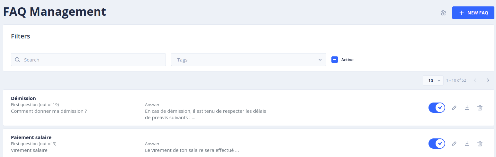
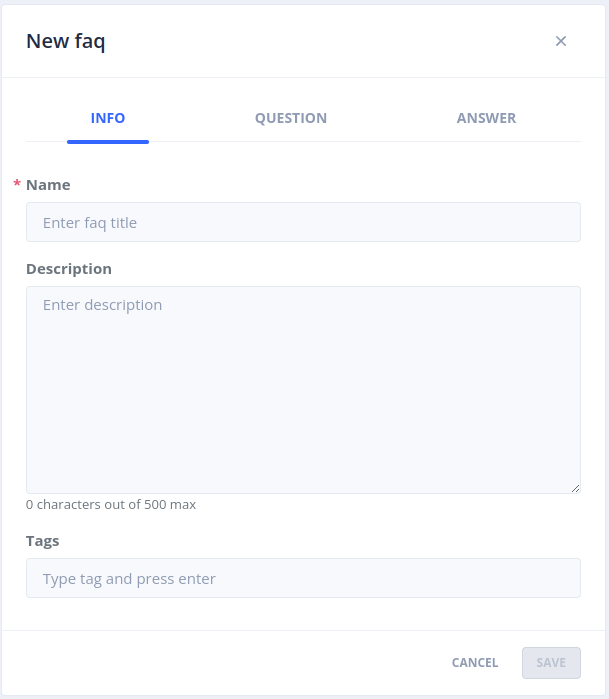

# Le menu _FAQ Management_

Le menu _FAQ Management_ permet de créer, modifier et enrichir les modèles conversationnels avec des questions de type _Foire Aux Questions_ (Questions/Réponses avec simple texte).
Il est destiné à un public métier non familier avec les concepts conversationnels (intentions, entités...).

> Pour accéder à cette page il faut bénéficier du rôle _botUser_ ( plus de détails sur les rôles dans [securité](../../admin/security.md#roles) ).

## Liste des FAQ

Cette page liste l'ensemble des FAQ existantes (avec pagination)

Pour chaque FAQ vous pouvez retrouver les éléments suivants :

- Son nom
- Le nombre de questions associées
- Un exemple de question
- Un extrait de la réponse retournée
- Un ensemble de tags

Les actions suivantes sont disponibles pour chaque FAQ :

- Enable/Disable : permet de désactiver une FAQ. Une fois désactivée, le bot n'enverra plus la réponse associée mais la réponse par défaut _unknown_
- _Edit_ : permet de modifier les éléments de la FAQ (nom, description, tags, questions, réponse)
- _Download_ : permet de télécharger la description de la FAQ au format JSON
- _Delete_ : permet de supprimer la FAQ. A noter que l'intention sous-jacente sera elle aussi supprimée. Les questions seront toutefois remisées dans l'Inbox.

## Création d'une nouvelle FAQ

Vous pouvez créer de nouvelles questions de FAQ en cliquant sur le bouton _+ New FAQ_.
Cela ouvre un panneau composé de 3 onglets.

> Une Story _Simple_ est automatiquement créée à la création d'une FAQ et lui est associée.

### Onglet _INFO_

Vous pouvez dans cet onglet :

- Définir le nom de la FAQ
- Donner une description pour expliquer à quoi elle répond
- Ajouter des tags afin de pouvoir regrouper des FAQ par thématique

> Le nom de la faq est utilisé pour générer l'intention sous-jacente qui y sera associée

### Onglet _QUESTION_

Dans cet onglet vous pouvez ajouter autant de questions que nécessaire afin d'alimenter le modèle.
Ces questions seront associée à l'intention sous-jacente à la FAQ.
Il est conseillé d'avoir un minimum de 10 questions avec des formulations variées afin que le modèle puisse avoir un taux de reconnaissance minimal.

### Onglet _ANSWER_

Dans cet onglet vous allez pouvoir définir la réponse qui devra être envoyée à l'utilisateur lorsque sa question est y fait référence.
La réponse est limitée à un format texte pouvant contenir du markdown sous réserve que l'interface de restitution le prenne en charge.

### Filtres

Il est possible de rechercher des phrases à qualifier en saisissant du texte dans le champ _Search_.

Il est également possible de filtrer la liste des FAQ en sélectionnant un ou plusieurs tags dans la liste déroulante.

Vous pouvez enfin filtrer les FAQ en limitant l'affichage à celles qui sont actives/inactives/toutes en utilisant la case à cocher _Active_.

### Configuration

Il est possible de configurer une Story par défaut qui sera exécutée à la suite de l'envoi de la réponse de la FAQ afin de collecter la satisfaction de l'utilisateur sur la qualité de la réponse apportée.

> Une _Rule_ de type _Ending_ est automatiquement créée et associée à la Story associée à la FAQ

Cocher la case _Ask for satisfaction after answering on FAQ question_ pour activer cette fonctionnalité.
Choisir une Story dans la liste déroulante _Select story_.

> Une _Rule_ de type _Activation_ sera automatiquement créée pour chaque FAQ

## Continuer...

Rendez-vous dans [_Guides utilisateur_](../../user/guides.md) pour la suite du manuel utilisateur.

> Vous pouvez aussi passer directement au chapitre suivant : [Développement](../../../dev/modes.md).
