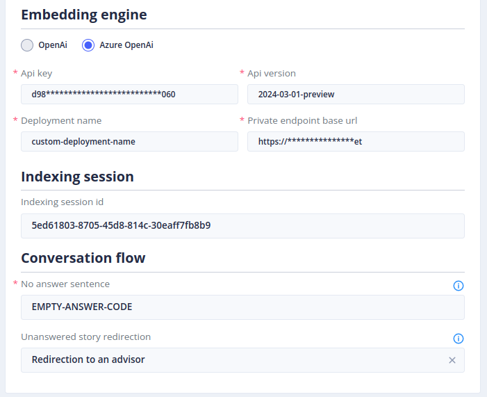
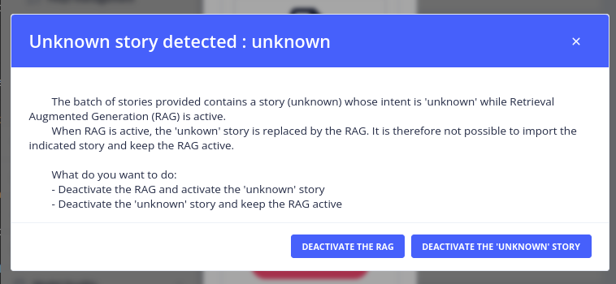
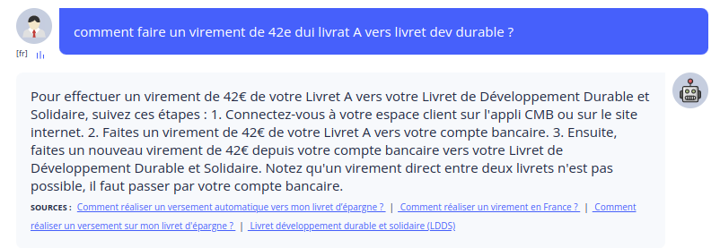

# Le menu *Gen AI / RAG Settings*

## Configuration
Le menu _Gen AI / RAG Settings_ (Retrieving augmented Generation) vous permet de choisir les modèles d'IA générative pris en charge par Tock et de configurer un ensemble de critères spécifiques à chaque fournisseur d'IA.
Cette fonctionnalité permettra à TOCK de générer une réponse à une requête de l'utilisateur, sur la base d'un ensemble de documents intégrés dans une base de données vectorielle.

> Pour accéder à cette page il faut bénéficier du rôle **_botUser_**.
>  ( plus de détails sur les rôles dans [securité](../../../../admin/security.md#roles) ).

### Activation du RAG & Configuration du LLM Engine

**RAG activation :**
- L’activation n’est possible qu’une fois que tous les champs marqués d’un * sont remplis.
- Une fois les champs remplis, choisir si oui ou non, le bot doit offrir l’option RAG.

**Un provider IA :** (LLM Engine)
- Cette section permet de paramétrer les options liées au modèle IA qui génère la réponse à l’utilisateur.
- Voir la [liste des fournisseurs d'IA](../../../../user/studio/gen-ai/providers/gen-ai-provider-llm-and-embedding.md)

**Température :**
- On peut définir une température située entre 0 et 1.
- Celle-ci permet de déterminer le niveau de créativité du Bot dans la réponse apportée à une requête qui lui est envoyée.

**Prompt :**
- Le prompt est le script qui détermine la personnalité du Bot, le contexte dans lequel il doit répondre, la façon dont il doit s’adresser à l’utilisateur, les recommandations ou instructions de réponses, les styles et formats de réponses.
 
### Embedding Engine & Gestion de la conversation 

**Un provider IA :** (Embedding Engine)
- Cette section permet de paramétrer les options liées au modèle IA qui interagit avec la base documentaire vectorisée.
- Voir la [liste des fournisseurs d'IA](../../../../user/studio/gen-ai/providers/gen-ai-provider-llm-and-embedding.md)

**Indexing session :**
- Renseigner l’ID de l’Indexing Session de votre base documentaire vectorisée

**Conversation Flow :**
- No rag sentences : Lorsque le LLM, via le prompt et sa base documentaire, n’arrive pas à apporter une réponse, il entre dans le Conversation Flow, ce qui permet d'activer une story particulière.
- Par exemple : “Désolé, je ne trouve aucune information documentaire pour vous répondre, souhaitez-vous parler à un conseiller ou reformuler votre question ?”

### Import d'une Story Unkown si le RAG est activé

**Attention :** Lorsqu’on importe les Story d’un bot à l'autre, et que la RAG est activée en dans le bot recepteur, un message d’avertissement apparait concernant la Story Unknown (Story qui permet au Bot de répondre qu’il ne connait pas la réponse à une question). 
- Deux options sont donc possibles :
  - Désactiver le RAG et permettre l’import de la Story Unknown.
  - Garder le RAG activé et importer la Story Unknown mais désactivée.

## Utilisation

Une fois le RAG configuré et activé, il peut être utilisé pour prendre le contrôle de toutes les questions qualifiées d'Inconnues par la NLP.

En voici un exemple :

