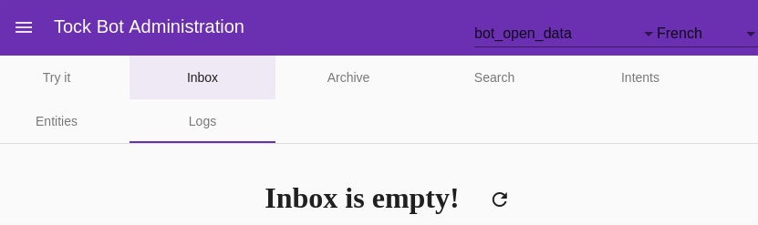

# L'interface Tock Studio

Cette page présente les caractéristiques générales de _Tock Studio_.

Les pages suivantes couvrent les différents menus de l'application et différentes fonctionnalités.

## Connexion à l'application

Un navigateur standard suffit pour accéder à _Tock Studio_. L'utilisateur est invité à s'authentifier :

 * Sur la [plateforme Tock de démonstration](https://demo.tock.ai/),
 l'utilisateur est invité à s'authentifier via son compte GitHub. Celui-ci doit alors accepter que Tock accède 
à son compte - seul l'identifiant du compte GitHub est lu par Tock.

* Sur une plateforme Tock par défaut, les identifiants sont `admin@app.com` / `password`. Les identifiants par défaut 
sont définis dans fichier source `bot/admin/web/src/environments/environment.ts` et il est recommandé de les modifier.

> Il est aussi possible, en alternative, d'utiliser un mécanisme d'authentification en amont de l'application, par exemple via 
>un service [Apache HTTPd](https://httpd.apache.org/) ou un service cloud comme [AWS Cognito](https://aws.amazon.com/fr/cognito/) 
>d'une part et un annuaire type [LDAP](https://fr.wikipedia.org/wiki/Lightweight_Directory_Access_Protocol) d'autre part.

## Le bandeau applicatif

En haut à gauche de l'interface se trouvent :

* Un bouton permettant d'afficher (ou de masquer) les différents menus _Tock Studio_

* Le nom de l'interface

En haut à droite de l'interface se trouvent :

* L'application / le bot couramment sélectionné
 (utile lorsque plusieurs bots co-existent sur la plateforme)

* La langue couramment sélectionnée (utile pour tester un bot multilingue)

* Un lien pour se déconnecter

## Continuer...

Rendez-vous dans [Menu _Configuration_](../../user/studio/configuration.md) pour la suite du manuel utilisateur. 

> Vous pouvez aussi passer directement au chapitre suivant : [Développement](../../../dev/modes.md). 