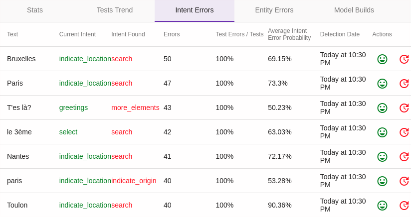

# Le menu _Model Quality_

Le menu _Model Quality_ (ou _NLU QA_) permet d'évaluer et de suivre dans le temps la qualité/pertinence/performance des modèles conversationnels.
 
## L'onglet _Model Stats_

Cet écran présente des graphes pour suivre l'évolution de plusieurs indicateurs de la qualité du modèle conversationnel :

* **Pertinence** : les scores des algorithmes de détection sur les intentions (_Intent average probability_) 
et sur les entités (_Entity average probability_)

* **Trafic / erreurs** : le nombre de sollicitations du modèle (_Calls_) et le nombre d'erreurs (_Errors_)

* **Performance** : le temps de réponse du modèle (_Average call duration_)

## L'onglet _Intent Distance_

Les métriques présentées en tableau dans cet page (_Occurrences_ et _Average Diff_) permettent d'identifier les intentions 
plus ou moins proches dans le modèle, notamment afin d'optimiser la modélisation. 

## L'onglet _Model Builds_

Cet écran présente des statistiques sur les dernières reconstructions du modèle. Il s'agit donc d'indications sur 
la performance du modèle.

## L'onglet _Tests Trends_

Les _tests partiels de modèle_ constituent un moyen classique de détecter les erreurs de qualification,
ou les problèmes de proximité des intentions (ou entités) entre elles.
 
> Il s'agit de prendre une partie du modèle actuelle au hasard (par exemple 90% des phrases du modèle) afin de construire
> un modèle légèrement moins pertinent, puis de tester les 10% restant avec ce nouveau modèle.
>
> Le principe posé, il ne reste plus qu'à répéter le processus un certain nombre de fois
> pour que les erreurs les plus fréquentes soient présentées à un correcteur manuel.
>
> Précision que ces tests ne présentent une utilité qu'avec des modèles déjà conséquents.

Cet onglet donne l'évolution de la pertinence des tests partiels de modèle.

> Par défaut, les tests sont programmés pour être lancés de minuit à 5h du matin, toutes les 10 minutes.
>Il est possible de configurer ce comportement avec la propriété `tock_test_model_timeframe` (par défaut : `0,5`).

## L'onglet _Test Intent Errors_

Cet écran présente les résultats des _tests partiels_ de détection d'intentions (voir ci-dessus), avec le détails des 
phrases/expressions reconnues différemment du modèle réel.

Dans cet exemple, aucune "vraie" erreur n'a été détectée. On peut toutefois constater que dans certains cas le modèle 
se trompe systématiquement, avec une probabilité élevée.

Pour chaque phrase il est possible via la colonne _Actions_ de confirmer que le modèle de base est correct (avec 
_Validate Intent_) ou de corriger l'erreur détectée (_Change The Intent_).

> Il est intéressant d'analyser périodiquement ces écarts, certaines différences s'expliquant bien, étant même 
>parfois "assumées" (faux négatifs), d'autres pouvant réveler un problème dans le modèle.

## L'onglet _Test Entity Errors_

A l'instar de _Intent Test Errors_ pour les entités, cet écran présente les résultats des _tests partiels_ de détection des entités.

> Il est intéressant d'analyser périodiquement ces écarts, certaines différences s'expliquant bien, étant même 
>parfois "assumées" (faux négatifs), d'autres pouvant réveler un problème dans le modèle.

## Continuer...

Rendez-vous dans [Menu _Settings_](../../user/studio/configuration.md) pour la suite du manuel utilisateur. 

> Vous pouvez aussi passer directement au chapitre suivant : [Développement](../../../dev/modes.md). 
