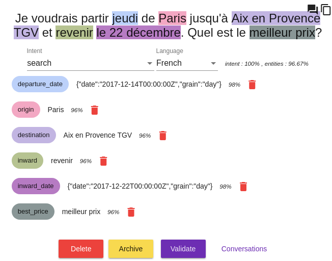
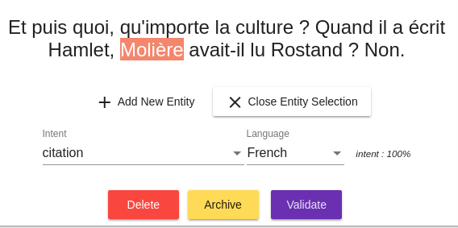
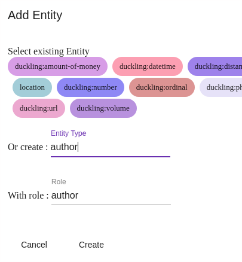
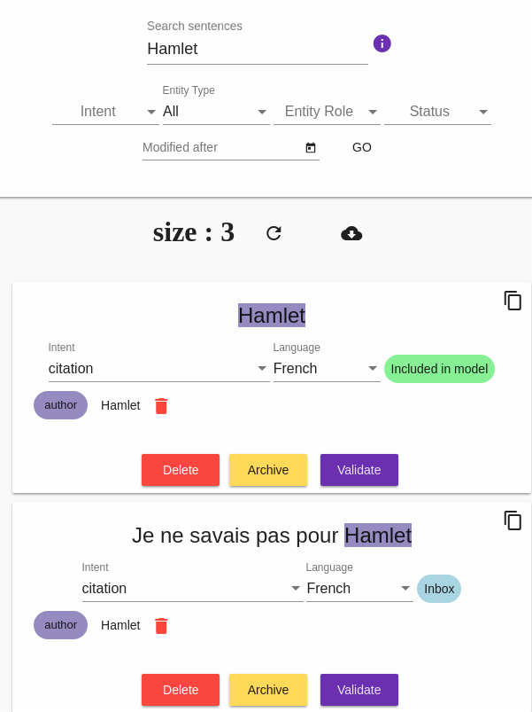

# Le menu *Language Understanding*

Le menu _Language Understanding_ (ou _NLU_) permet de créer, modifier, enrichir les modèles conversationnels :
 déclarer des _intentions_ et des _entités_, _qualifier_ des phrases, etc. (voir [Concepts](../concepts.md)
 pour en savoir plus).
 
Dans cette page, le détail de chaque onglet est présenté. Voir aussi [Construire les modèles conversationnels](../guides/build-model.md)
pour une présentation plus guidée par l'usage.

## L'onglet *New Sentence*

Cet écran permet d'entrer des phrases et et de vérifier quelle intention/entités sont détectées.

Saisissez une phrase et validez pour voir la détection résultant du modèle conversationnel (en pratique : comment le bot 
interprète la phrase). S'affichent alors :

* _Intent_ : l'intention reconnue
* _Language_ : la langue détectée
* Le(s) score(s) retourné(s) par les algorithmes (selon leur niveau de confiance sur l'intention et 
sur les éventuelles entités)
* Le cas échéant, chaque entité détectée avec son rôle/type et son score

Il est possible de modifier tous les éléments détectés depuis cet écran :

* Pour modifier l'intention (voire en créer une nouvelle à la volée) ou la langue détectées, utilisez les champs / 
listes de sélection sous la phrase 
* Pour supprimer une entité, utilisez le bouton à côté du score de l'entité
* Pour ajouter une entité, sélectionnez avec la souris un bloc de mots dansla phrase puis précisez son rôle/type.

> Remarque : si vous avez activé cette option au niveau de l'application/bot, il est possible de déclarer des 
>_sous-entités_. Vous en apprendrez plus dans [Construire les modèles conversationnels](../guides/build-model.md).

Les boutons et commandes suivantes sont disponibles pour la phrase dans sa globalité :

* _Delete_ : supprime la phrase
* _Unknown_ : qualifier la phrase en intention inconnue (réponse par défaut)
* _Validate_ : confirmer l'intention/entités détectées et enregistrer la phrase dans le modèle 
(provoquant in fine une reconstruction du modèle, son _corpus_ étant enrichi de cette phrase)

D'autres liens sont accessibles pour afficher les conversations contenant cette phrase, copier le contenu de la 
phrase, créer un parcours à partir de cette phrase.

## L'onglet *Inbox*

Cet onglet montre (avec de la pagination et quelques options d'affichage) l'ensemble des phrases reçues par le modèle 
 _NLU_ avec les intentions/entités/langue/scores détectés.
 
Ces phrases peuvent provenir de véritables utilisateurs quelques soient les canaux, d'une saisie dans l'onglet _Try it_ 
ou encore d'une conversation via la page _Test the bot_ dans _Tock Studio_.
 
> Lorsque vous faites des tests depuis un canal externe, n'hésitez pas à cliquer sur le bouton _Refresh_ 
>(en haut à gauche de l'écran) pour rafraîchir la liste des phrases.

Les boutons et commandes sous chaque phrase sont identiques à ceux de l'onglet _Try it_ (voir ci-dessus).

## L'onglet *Search*

Cet écran permet de faire des recherches dans l'ensemble des phrases : _Inbox_ mais aussi phrases qualifiées 
enregistrées dans le modèle.

## L'onglet *Unknown*

Cet écran permet de parcourir les phrases dont l'intention n'a pas été reconnue (intention _unknown_).

## L'onglet *Intents*

Cet écran permet de gérer les intentions.

## L'onglet *Entities*

Cet écran permet de gérer les entités, notamment les notions d'entités partagées.

## L'onglet *Logs*

Cet écran présente le journal complet des phrases reçues et permet de remonter aux conversations (ie. l'ensemble des 
phrases reçues et réponses du bot pour un utilisateur).

> Remarque : contrairement à la vue _Inbox_, les _Logs_ montrent les phrases reçues même lorsqu'elles existent déjà à 
>l'identique dans le modèle (dans ce cas, le modèle et les algorithmes ne sont même pas interrogés, la réponse étant 
>connue).

## Continuer...

Rendez-vous dans [Menu _Stories & Answers_](../studio/stories-and-answers.md) pour la suite du manuel utilisateur. 

> Vous pouvez aussi passer directement au chapitre suivant : [Développement](../../dev/modes.md). 
