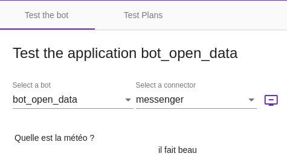

# Le menu _Test_

Le menu _Test_ permet de tester un bot directement dans l'interface _Tock Studio_, ainsi que de gérer des plans de 
tests automatiques.
 
## L'onglet _Test the Bot_

Via ce menu, vous pouvez parler directement au bot en simulant différentes langues et connecteurs.
Cela permet de tester rapidement et simplement un bot dans l'interface _Tock Studio_, 
sans avoir à utiliser de logiciels et canaux externes.

> L'interface reste minimale car l'objectif est de tester rapidement le bot, pas d'obtenir 
une véritable interface utilisateur ni même un rendu identique à celui de tel ou tel connecteur.
>
> Selon le type de messages renvoyés par le bot et selon le connecteur utilisé, il se peut que le rendu dans 
>l'écran _Test the bot_ ne soit pas satisfaisant. En effet, pour une compatibilité parfaite avec cet écran,
>les connecteurs doivent respecter certaines règles d'implémentation.
>
> Si vous constatez qu'un certain type de message pour un connecteur donné n'est pas bien géré dans cette
>interface, n'hésitez pas à remonter une [_issue_ GitHub](https://github.com/theopenconversationkit/tock/issues). 

Pour parler à un bot dans l'interface, une fois dans _Test_ > _Test the bot_ :

* Vérifiez la langue (en haut à droite de l'interface)
* Sélectionnez une application/un bot
* Sélectionnez un connecteur à émuler
* Commencez à saisir des phrases...

Voici un autre exemple avec une conversation comprenant des composants riches du connecteur Messenger, avec leur rendu 
 dans l'interface générique _Tock Studio_ :

Pour chaque échange de messages avec le bot, la langue détectée est indiquée. En cliquant sur 
 _View Nlp Stats_ vous pouvez voir le détail de la réponse du modèle : intention, entités, scores, etc.

## L'onglet _Test Plans_

Cet outil permet de créer et de suivre l'exécution de tests de conversations automatisés, afin de vérifier 
automatiquement et régulièrement la non-régression du bot. Cette partie est en plein développement et une documentation 
complète arrivera prochainement.

## Continuer...

Rendez-vous dans [Menu _Analytics_](../../user/studio/analytics.md) pour la suite du manuel utilisateur. 

> Vous pouvez aussi passer directement au chapitre suivant : [Développement](../../../dev/modes.md). 
