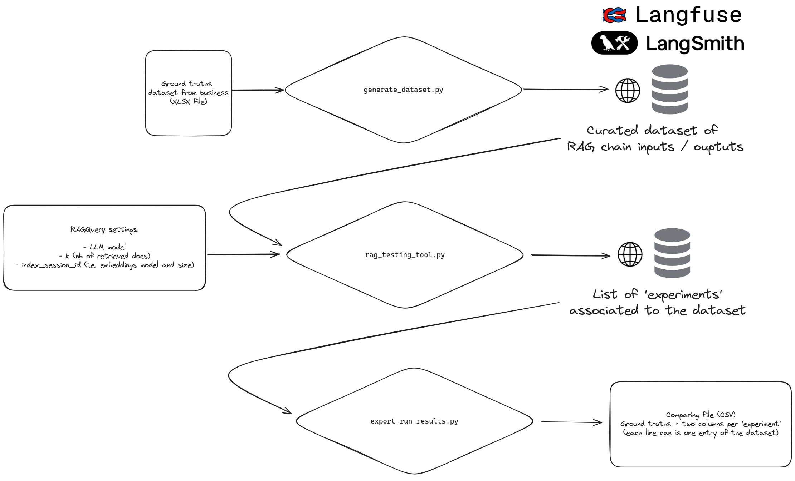

# TOCK indexing and testing tools

A collection of tools to:

- ingest data into a Vector DB
- test specific RAG settings against a dataset.

## Installing toolset

Install tools using Poetry from package directory base:

`poetry install --no-root`

Install pre-commit for format code before commit:

`pre-commit install`

Then run the scripts by passing them to a Python interpreter (>= 3.9):

`python <script> <args>`

## Data ingestion


### Data processing

#### smarttribune_formatter.py

```
Smart Tribune export file formatter.

Usage:
smarttribune_formatter.py [-v] <input_csv> <tag_title> <base_url> <output_csv>

Arguments:
input_csv   path to the Smart Tribune CSV export file
tag_title   tag title to discrimate FAQ source ('Tag (ID system)' column will be filtered for lines containing this tag)
base_url    the base URL to prefix every FAQ entry's query parameter to create a full URL
output_csv  path to the output, ready-to-index CSV file

Options:
-h --help   Show this screen
--version   Show version
-v          Verbose output for debugging (without this option, script will be silent but for errors)
```

Turns a Smart Tribune CSV export file into a ready-to-index CSV file (one 'title'|'url'|'text' line per filtered entry):


| Title      | URL                | Text                  |
|------------|--------------------|-----------------------|
| Some title | http://example.com | This is example text. |
| ...        | ...                | ...                   |


### smarttribune_consumer.py

```
Smart Tribune import data and formatter for send in opensearch.

Usage:
    smarttribune_consumer.py [-v]  <knowledge_base>  <base_url> <output_csv> [options]

Arguments:
    knowledge_base  name of the target knowledge base, ex: "name1 | name2 | name3"
    base_url    the base URL to prefix every FAQ entry's query parameter to
                create a full URL
    output_csv  path to the output, ready-to-index CSV file

Options:
    --tag_title=<value>
    -h --help   Show this screen
    --version   Show version
    -v          Verbose output for debugging (without this option, script will
                be silent but for errors)

Import and Format a Smart Tribune data by API  into a ready-to-index CSV file
(one 'title'|'url'|'text' line per filtered entry).
```
Set in a .env your APIKEY and your APISECRET

Import data from smart tribune API and return a ready-to-index CSV file (one 'title'|'url'|'text' line per filtered entry):


| Title      | URL                | Text                  |
|------------|--------------------|-----------------------|
| Some title | http://example.com | This is example text. |
| ...        | ...                | ...                   |


#### webscraper.py

```
Simple recursive webscraper based on a list of BeautifulSoup filters.

Usage:
webscraping.py [-v] <input_urls> <soup_filters> <output_csv>
webscraping.py -h | --help
webscraping.py --version

Arguments:
input_urls      a comma-separated list of base URLs the scraper will browse recursively to find scrapable contents
soup_filters    a comma-separated list of filters to get pages contents (texts to be indexed will be concatenated in this order)
                Example: id='notes',class_='container',id='test'
output_csv      path to the output, ready-to-index CSV file (this file will be created at execution time, along with a <base URL netloc>/ sub-dir in the same directory,    containing debug info)

Options:
-h --help   Show this screen
--version   Show version
-v          Verbose output for debugging (without this option, script will be silent but for errors)
```

Recursively browse web URLs (follow links from these base URLs), then scrape links' contents based on a list of BeautifulSoup filters, then export these contents into a ready-to-index CSV file (one 'title'|'url'|'text' line per URL with scraped contents):


| Title      | URL                | Text                  |
|------------|--------------------|-----------------------|
| Some title | http://example.com | This is example text. |
| ...        | ...                | ...                   |

### Documents indexing

#### index_documents.py

Index a ready-to-index CSV file ('title'|'url'|'text' lines) file contents into an OpenSearch vector database.

```
Usage:
    index_documents.py [-v] <input_csv> <index_name> <embeddings_cfg> <chunks_size> [<env_file>]
    index_documents.py -h | --help
    index_documents.py --version

Arguments:
    input_csv       path to the ready-to-index file
    index_name      name of the OpenSearch index (shall follow indexes naming rules)
    embeddings_cfg  path to an embeddings configuration file (JSON format) (shall describe settings for one of OpenAI or AzureOpenAI embeddings model)
    chunks_size     size of the embedded chunks of documents

Options:
    -h --help   Show this screen
    --version   Show version
    -v          Verbose output for debugging (without this option, script will be silent but for errors and the unique indexing session id)
```

Index a ready-to-index CSV file contents into an OpenSearch vector database.

CSV columns are 'title'|'url'|'text'. 'text' will be chunked according to chunks_size, and embedded using configuration described in embeddings_cfg (it uses the embeddings constructor from the orchestrator module, so JSON file shall follow corresponding format - See [Embedding Settings](../server/src/gen_ai_orchestrator/models/em/em_types.py)).

Documents will be indexed in OpenSearch DB under index_name index (index_name shall follow OpenSearch naming restrictions) with the following metadata:


| Metadata tag     | Description                                                      |
|------------------|------------------------------------------------------------------|
| index_session_id | a uuid for the indexing session (running this script)            |
| index_datetime   | the date of the indexing session                                 |
| id               | a uuid for each document (one per line in the input file)        |
| chunk            | the nb of the chunk if the original document was splitted: 'n/N' |
| title            | the 'title' column from original input CSV                       |
| url              | the 'url' column from original input CSV                         |

A unique indexing session id is produced and printed to the console (will be the last line printed if the '-v' option is used).

## OpenSearch Configuration

To configure the OpenSearch vector store, you can use the following environment variables:

| Variables                                                    | Description                                                                         | Default     |
|--------------------------------------------------------------|-------------------------------------------------------------------------------------|-------------|
| tock_gen_ai_orchestrator_open_search_host                    | The OpenSearch host                                                                 | 'localhost' |
| tock_gen_ai_orchestrator_open_search_port                    | The OpenSearch port                                                                 | '9200'      |
| tock_gen_ai_orchestrator_open_search_aws_secret_manager_name | The optional AWS secret name that store the OpenSearch user credentials             | None        |
| chtock_gen_ai_orchestrator_open_search_user                  | The OpenSearch user (Raw value)                                                     | 'admin'     |
| tock_gen_ai_orchestrator_open_search_pwd                     | The OpenSearch password (Raw value)                                                 | 'admin'     |
| tock_gen_ai_orchestrator_open_search_timeout                 | Request timeout: set the maximum time (in seconds) for the request to be completed. | '4'         |


## Testing RAG settings on dataset



### generate_dataset.py

Generates a testing dataset based on an input file. The input file should have the correct format (see generate_datset_input.xlsx for sample). The generated dataset can be saved on filesystem, using the --csv-output option, on langsmith, using the --langsmith-dataset-name option, on langfuse using the --langfuse-dataset-name option, or both.

```
Usage:
    generate_dataset.py [-v] <input_excel> --range=<s> [--csv-output=<path>] [ --langsmith-dataset-name=<name> ] [ --langfuse-dataset-name=<name> ] [--locale=<locale>] [--no-answer=<na>]
    generate_dataset.py [-v] <input_excel> --sheet=<n>... [--csv-output=<path>] [ --langsmith-dataset-name=<name> ] [ --langfuse-dataset-name=<name> ] [--locale=<locale>] [--no-answer=<na>]

Arguments:
    input_excel path to the input excel file

Options:
    --range=<s>                     Range of sheet to be parsed. The expected format is X,Y where X is the first sheet to be included, and Y is the last. Indices are 0-indexed.
    --sheet=<n>                     Sheet numbers to be parsed. Indices are 0-indexed.
    --csv-output=<path>             Output path of csv file to be generated.
    --langsmith-dataset-name=<name> Name of the dataset to be saved on langsmith.
    --langfuse-dataset-name=<name> Name of the dataset to be saved on langfuse.
    --locale=<locale>               Locale to be included in de dataset. [default: French]
    --no-answer=<na>                Label of no_answer to be included in the dataset. [default: NO_RAG_SENTENCE]
    -h --help                       Show this screen
    --version                       Show version
    -v                              Verbose output for debugging (without this option, script will be silent but for errors)
Generates a testing dataset based on an input file. The input file should have the correct format (see generate_datset_input.xlsx for sample). The generated dataset can be saved on filesystem, using the --csv-output option, on langsmith, using the --langsmith-dataset-name option, on langfuse using the --langfuse-dataset-name option, or both.
```

### rag_testing_tool.py

Retrieval-Augmented Generation (RAG) endpoint settings testing tool based on LangSmith's or LangFuse's SDK: runs a specific RAG Settings configuration against a reference dataset.

```
Usage:
    rag_testing_tool.py [-v] <rag_query> <dataset_provider> <dataset_name> <test_name> [<delay>]
    rag_testing_tool.py -h | --help
    rag_testing_tool.py --version

Arguments:
    rag_query       path to a JSON 'RAGQuery' JSON file containing RAG settings
                    to be tested: llm model, embedding model, vector database
                    provider, indexation session's unique id, and 'k', i.e. nb
                    of retrieved docs (question and chat history are ignored,
                    as they will come from the dataset)
    dataset_provider the dataset provider (langsmith or langfuse)
    dataset_name    the reference dataset name
    test_name       name of the test run

Options:
    delay       Delay between two calls to the inference method in ms
    -h --help   Show this screen
    --version   Show version
    -v          Verbose output for debugging (without this option, script will
                be silent but for errors)
```

Build a RAG (Lang)chain from the RAG Query and runs it against the provided LangSmith or LangSmith dataset. The chain is created anew for each entry of the dataset, and if a delay is provided each chain creation will be delayed accordingly.
### export_run_results.py

Export a LangSmith dataset run results, in csv format.

```
Usage:
    export_run_results.py [-v] <dataset_id> <session_ids>...
    export_run_results.py -h | --help
    export_run_results.py --version

Arguments:
    dataset_id      dataset id
    session_ids     list of session ids

Options:
    -h --help   Show this screen
    --version   Show version
    -v          Verbose output for debugging

The exported CSV file will have these columns :
'Reference input'|'Reference output'|'Response 1'|'Sources 1'|...|'Response N'|'Sources N'
NB: There will be as many responses as run sessions
```
